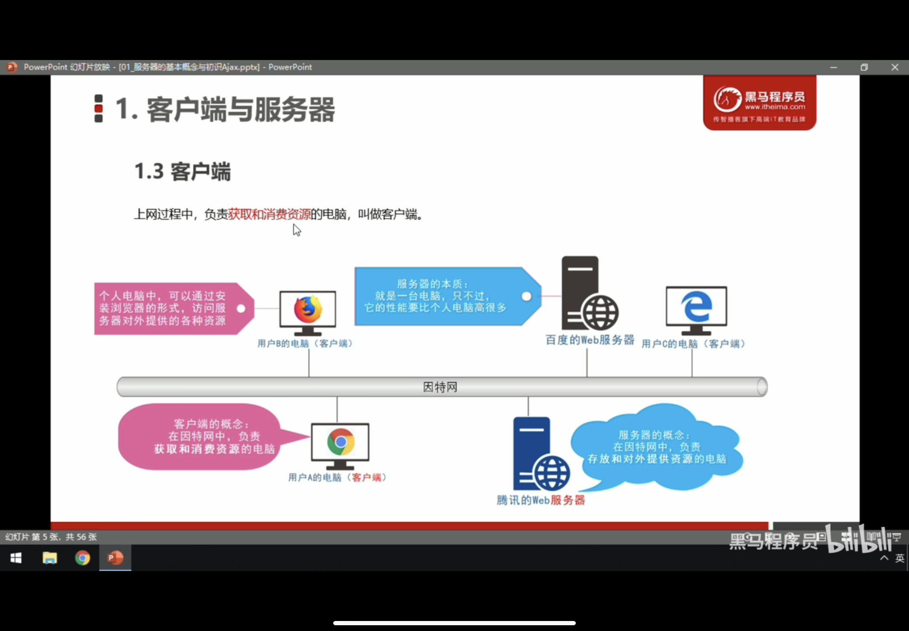
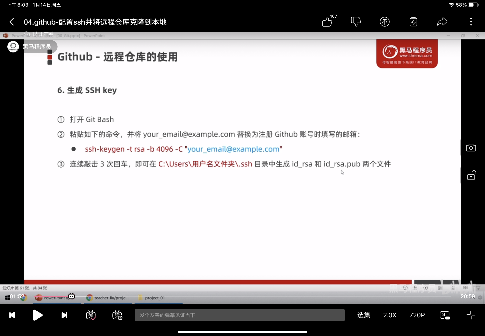
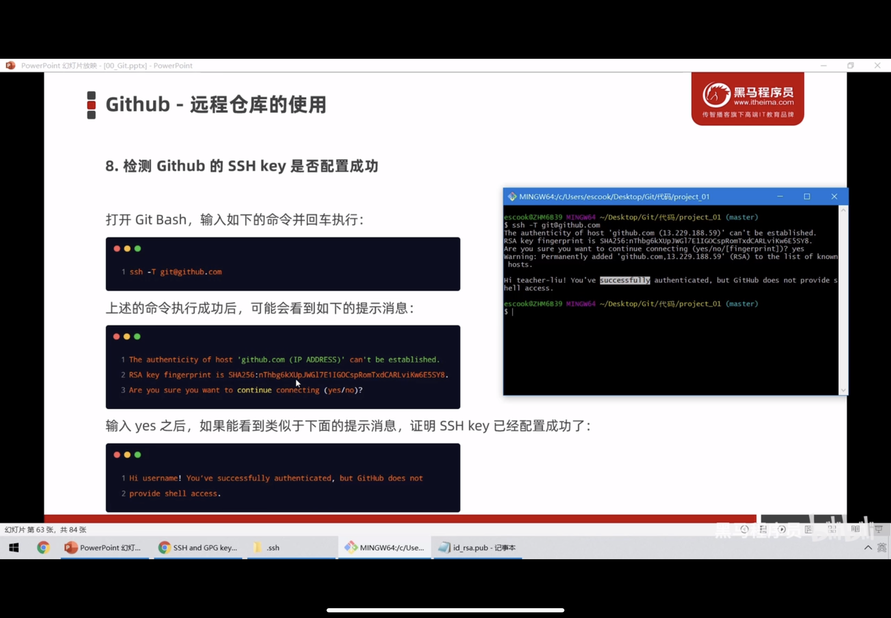
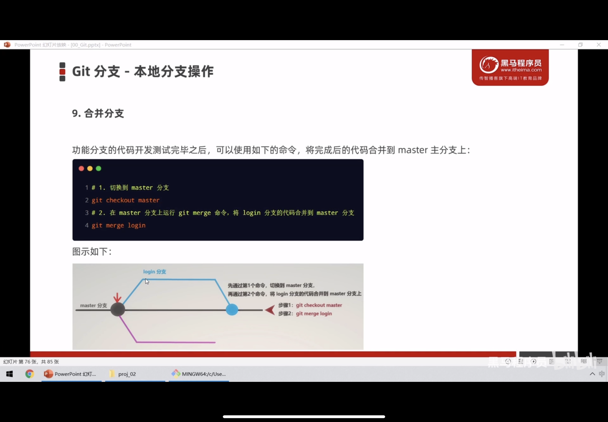
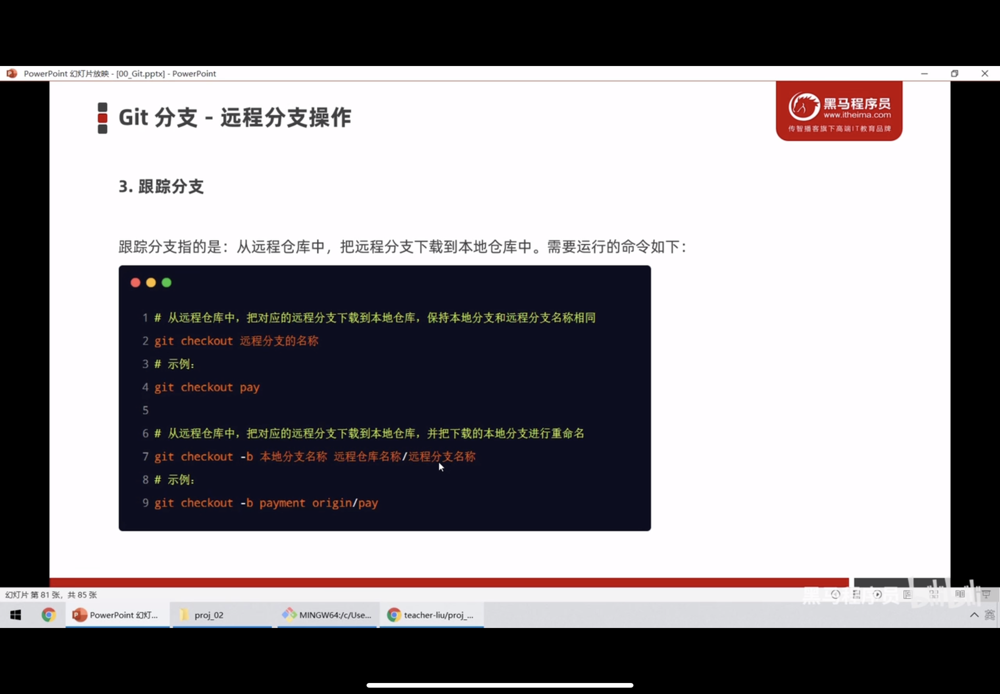
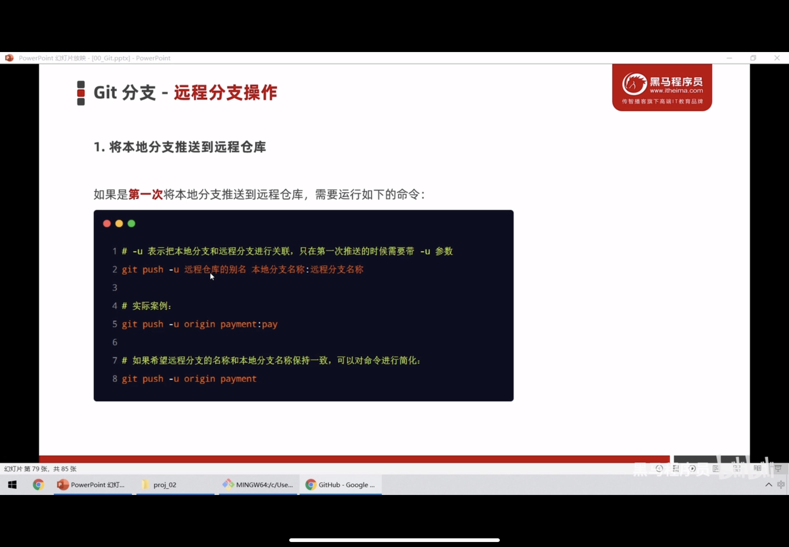
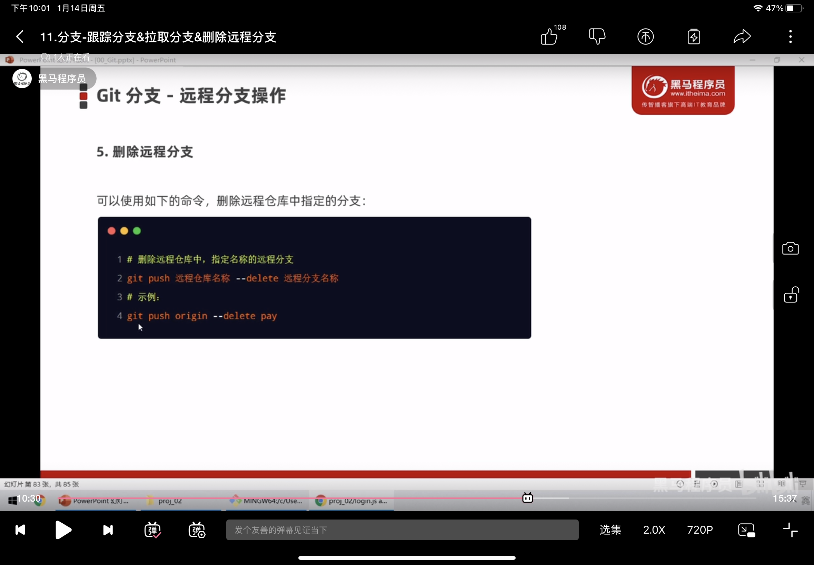

# 一、客户端和服务器

## 1.客户端



## 2.服务器


## 3.客户端和服务器的通信过程


## 4.服务器提供了那些资源？

图片，音频，视频，数据

### 4.1网页如何请求数据


### 4.2资源请求方式


# 二、ajax

ajax能让我们实现网页和服务器之间的数据交互


## 1.$.get()

.png)

```html

<!DOCTYPE html>
<html lang="en">
<head>
  <meta charset="UTF-8">
  <meta http-equiv="X-UA-Compatible" content="IE=edge">
  <meta name="viewport" content="width=device-width, initial-scale=1.0">
  <title>Document</title>
  <script src="../jQuery.min.js"></script>
  <style>
    div{
      width: 30px;
      height: 30px;
      background-color: red;
    }
  </style>
</head>
<body>
  <div></div>
  <script>
    $(function() {
      $('div').on('click', function() {
        $.get('http://www.liulongbin.top:3006/api/getbooks', {id: 484}, function(e) {
          console.log(e);
        });
      })
    })
  </script>
</body>
</html>
```

## 2.$.post()

语法和get一样

```html
<!DOCTYPE html>
<html lang="en">
<head>
  <meta charset="UTF-8">
  <meta http-equiv="X-UA-Compatible" content="IE=edge">
  <meta name="viewport" content="width=device-width, initial-scale=1.0">
  <title>Document</title>
  <script src="../jQuery.min.js"></script>
  <style>
    div{
      width: 100px;
      height: 100px;
      background-color: red;
    }
  </style>
</head>
<body>
  <div></div>
  <script>
    $(function() {
      $('div').on('click', function() {
        $.post('http://www.liulongbin.top:3006/api/addbook',
        {bookname: "啦啦啦德玛西亚", author: "草丛三剑客", publisher: "德玛西亚"},
        function(e) {
          console.log(e);
        });
      })
      $('div').on('click', function() {
        $.get('http://www.liulongbin.top:3006/api/getbooks', function(e) {
          console.log(e);
        });
      })
      $('div').on('click', function() {
        $.get('http://www.liulongbin.top:3006/api/getbooks',{id: 531}, function(e) {
          console.log(e);
        });
      })
    })
  </script>
</body>
</html>
```

## 3.$.ajax()

type：分为两类：'GET' 和 ' POST'

```html

<!DOCTYPE html>
<html lang="en">
<head>
  <meta charset="UTF-8">
  <meta http-equiv="X-UA-Compatible" content="IE=edge">
  <meta name="viewport" content="width=device-width, initial-scale=1.0">
  <title>Document</title>
  <script src="../jQuery.min.js"></script>
  <style>
    div{
      width: 30px;
      height: 30px;
      background-color: red;
    }
  </style>
</head>
<body>
  <div></div>
  <script>
    $(function() {
      $('div').on('click', function() {
        $.ajax({
          type: 'GET',
          url: 'http://www.liulongbin.top:3006/api/getbooks', 
          data: {id: 484},
          success: function(e) {
          console.log(e);
          }
        })
      })
    })
  </script>
</body>
</html>
```

## 4.接口


### 4.1接口测试工具

接口测试工具能让我们在不写任何代码的情况下，对接口进行测试和调用 postman


# 三、通信协议

## 1.什么是通信


## 2.什么是通信协议


## 3.http协议


## 4.http交互模型


## 5.http请求消息


### 5.1请求消息组成部分


### 5.2请求头部 


### 5.3请求体（get没有请求体）


## 6.响应消息


### 6.1响应行


### 6.2响应头部

键值对的方式

### 6.3响应体

在客户端response中可查看响应体


# 四、版本控制系统

## 1.版本控制软件


## 2.使用版本控制软件的好处


## 3.版本控制软件的分类


## 4.集中化版本控制系统


### 4.1 SVN的差别比较


## 5.分布式版本控制系统


### 5.1 Git 记录快照而非差异比较


git几乎所有的操作都在本地执行，只需要访问本地文件和资源，一般不需要来自网络上其他计算机的信息


### 5.2 git的三个工作区

工作区

暂存区

git仓库


### 5.3 git的三种工作状态

已修改

已暂存

已提交

## 6、安装并配置git

### 6.1 配置用户信息

### 6.2 git全局配置文件

* 在c盘   用户  .gitconfig 里面 ，可以用记事本打开 查看自己设置过哪些全局对象
*  使用如下语句，可以查看配置信息


### 6.3 获取帮助信息


## 7.git基本操作

### 7.1 获取git仓库的两种方式

* 将尚未进行版本控制的本地目录转换为git仓库
* 从其他服务器克隆一个已存在的Git仓库
* 以上两种方式都可以在自己电脑上获得一个Git仓库

### 7.2 在现有目录中初始化仓库

到想要初始化的跟目录中打开 git bash 然后输入以下代码


### 7.3 工作区中文件的四种状态

### 7.4 git status检查文件状态  在其后加上 -s 表示以精简的方式查看文档状态 相当于 --short


### 7.5 git add 来添加需要跟踪的文件，放入暂存区

### 7.6 提交已暂存的文件

git commit -m "提交消息"

### 7.7 更新提交

* git add

* git commit

### 7.8 撤销修改


### 7.9 一次性提交许多个文件

git add .

### 7.10 取消暂存的文件

git reset HEAD 要移除的文件名称

### 7.11 跳过暂存区域，直接提交

git commit -a -m "提交的消息"

### 7.12 移除文件

* 从git仓库和工作区中同时移除  git rm -f  文件名
* 从git仓库中移除  但在工作区中保留  git rm --cached 文件名

### 7.13 忽略文件

.gitignore 文件里面写上需要忽略的文件

* 格式规范

  

* glob模式

* 

### 7.14 查看提交历史


回到历史版本


### 7.15 小结


# 五、github相关概念

## 1.开源相关概念

开发的源代码

## 2.开源许可协议


## 3.开源项目托管平台


## 4.GitHub


## 5.远程仓库的两种访问方式

### 5.1 HTTPS：零配置；但是每次访问仓库时，需要重复输入GitHub的账号和密码

### 5.2 SSH : 需要进行额外的配置，但是配置成功后，每次访问都不用输入账号和密码

* 实际开发中 推荐使用ssh方式访问
* SSH key 可以实现本地仓库和GitHub之间免登陆=录的加密数据传输
* 
* 设置ssh key
* 
* 
* 配置ssh key
* 
* 

## 6.git分支

* 在进行多人协作开发时，为了防止相互干扰，提高协同开发的体验，建议每个开发者都基于分支进行项目功能的开发

* 在初始化本地git仓库时，git已经默认给我们创建了一个主分支：master，用来保存和记录整个项目已经完成的功能代码

* 由于不能直接在master上进行开发，所以就有了功能分支的概念
  * 功能分支：专门用来开发新功能的分支，当新功能开发测试完毕之后，最终要合并到master分支上

## 7.分支操作

* 查看分支列表 git branch
* 创建新分支 git branch 分支名称
* 切换分支 git checkout 分支名称
* 分支的快速创建和切换 git checkout -b
* 合并分支   git merge 分支名字  
* 
* 删除分支 git branch -d 分支名字
* 

## 8.远程分支操作--推送分支



## 9.跟踪分支


## 10.拉取远程分支的最新代码

git pull

## 11.删除远程分支



## 12.查看远程分支列表信息

```git
git remote show 远程仓库名称
```


