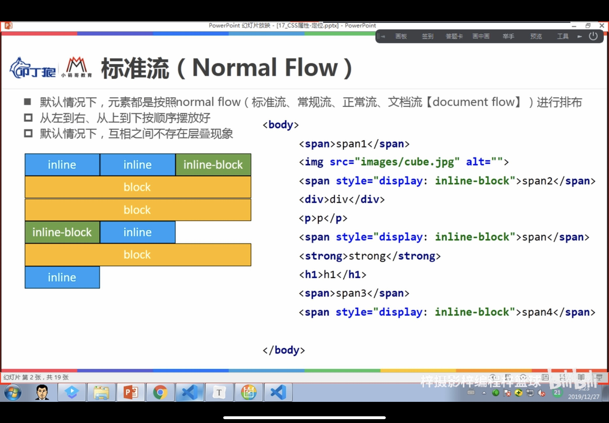
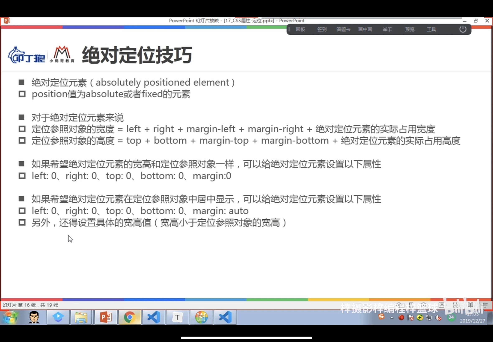
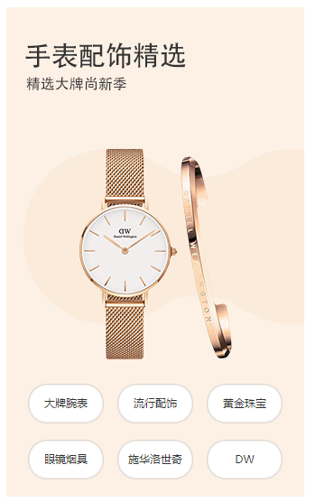
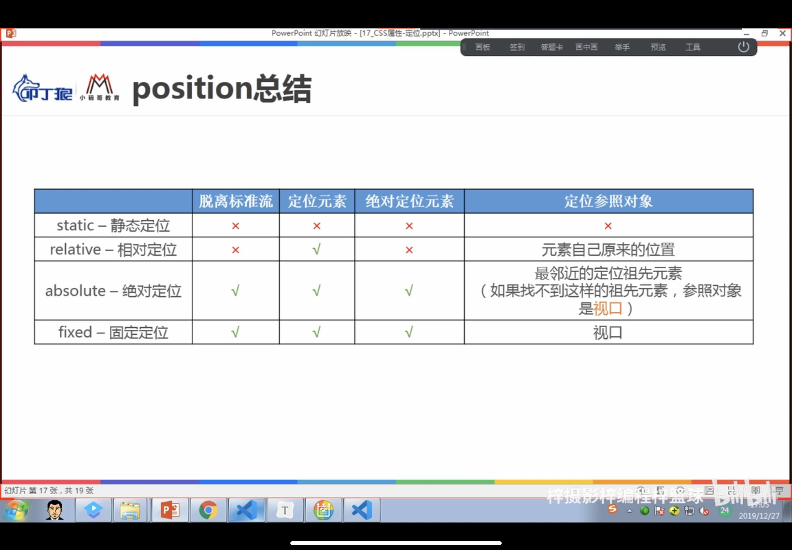
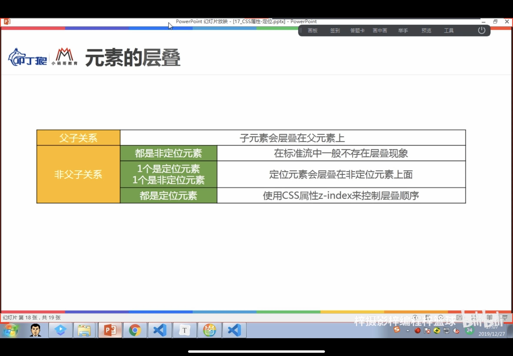
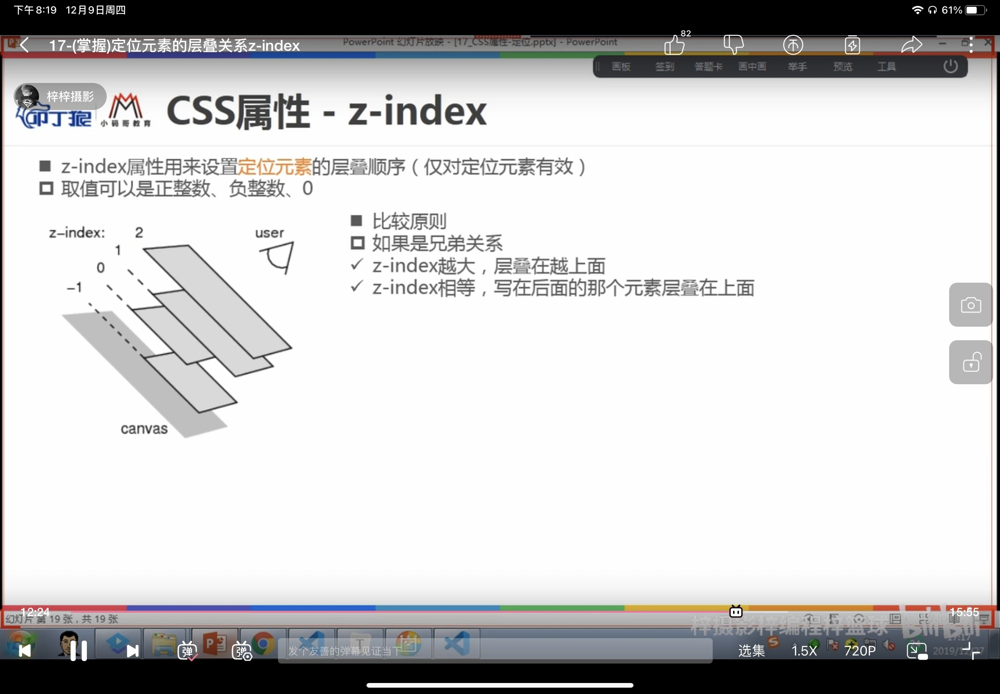

# 一、cursor

可以设置鼠标指针在元素上面时的显示样式

## 1.常见设值

* auto:

浏览器根据上下文决定指针的显示样式，比如根据文本或者非文本切换指针样式

* default:

箭头效果

* pointer

小手效果

* text

竖线效果

* none

什么效果都无

# 二、css属性-定位

## 1、标准流（Normal Flow）

默认情况下，元素都是按照标准流进行排布

从左到右，从上到下按顺序摆放好

默认情况下不存在层叠情况



可以通过margin、padding来进行位置调整，但是会影响其他元素位置

## 2、css属性-position

取值：

* static：静态定位(默认，按照标准流定位)

* relative：相对定位
  * 元素按照标准流定位
  * 可以通过left、right、top、bottom进行定位
  * 定位参照对象是元素自己原来的位置

* absolute：绝对定位

  

  * 元素脱离normal flow

  * 可以通过left、right、top/bottom来定位

  * 定位参照对象为最邻近的定位祖先元素

  * 如果找不到这样的祖先元素，参照对象是视口

  * **子绝父相**：

    * 在大部分情况下，子元素的绝对定位都是相对于父元素进行定位
    * 如果希望子元素相对于父元素进行定位，又不希望父元素脱标，常用解决方案为：父元素设置相对定位，子元素设置绝对定位，简称“子绝父相”。

  * 考拉商品展示图片案例

    ```html
    <!DOCTYPE html>
    <html lang="en">
    <head>
        <meta charset="UTF-8">
        <meta http-equiv="X-UA-Compatible" content="IE=edge">
        <meta name="viewport" content="width=device-width, initial-scale=1.0">
        <title>Document</title>
        <link rel="stylesheet" href="../css/reset.css">
        <style>
            .beauty-left{
                position: relative;
                display: inline-block;
            }
    
            .beauty-left ul{
               
                position: absolute;
                bottom: 10px;
                width: 280px;
                
                text-align: justify;
                text-align-last: justify;
    
                /* 居中显示 */
                left: 0;
                right: 0;
                margin: 0 auto;
    
    
               
            }
    
            .beauty-left ul li{
                display: inline-block;
                width: 80px;
                height: 18px;
                padding: 11px 0;
                margin: 10px 0;
                
                font-size:12px;
                color: #333;
                background-color: #fff;
    
                /* 覆盖父元素的justify */
                text-align: center;
                text-align-last: center;
    
                border: 1px solid #ededed;
                border-radius: 20px;
                box-shadow: 0 0 0 1px rgba(0,0,0,.1);
    
            }
    
            .beauty-left ul li a:hover{
                color:#ff1e32;
            }
        </style>
        
    </head>
    <body>
    
        <div class="beauty-left">
            <a href="#">
                
            </a>
            <ul>
                <li><a href="#">大牌腕表</a></li>
                <li><a href="#">流行配饰</a></li>
                <li><a href="#">黄金珠宝</a></li>
                <li><a href="#">眼镜烟具</a></li>
                <li><a href="#">施华洛世奇</a></li>
                <li><a href="#">DW</a></li>
            </ul>
    
        </div>
    </body>
    </html>
    ```

    效果图如下：利用绝对定位让下面的六个链接实现放在图片底部的效果，并且鼠标悬浮下面六个连接上可以变红

    

* 二维码案例

```html
<!DOCTYPE html>
<html lang="en">
<head>
    <meta charset="UTF-8">
    <meta http-equiv="X-UA-Compatible" content="IE=edge">
    <meta name="viewport" content="width=device-width, initial-scale=1.0">
    <title>Document</title>
    <link rel="stylesheet" href="../css/reset.css">
    <style>
        .phone{
            position:relative;
                        
            /* 方便观察 */
            margin-left: 200px;

        }

        .phone .code span{
            display: block;
            text-align: center;
            margin-bottom: 3px;
        }

        .phone .code{
            position:absolute;
            top:20px;
            /* left: -90px; */
            transform: translate(-50%);
            left: 50%; 

            padding: 5px;
            margin-top: 20px;
          
            border: 1px solid #ededed;

            display: none;
        }
          
        .title{
            font-size: 14px;
        }

        .arrow{
            position:absolute;
            top: -6px;
            left: 0;
            right: 0;
            margin: 0 auto;
            /* transform: translate(-50%); */
            /* left: 50%; */

            width: 10px;
            height: 10px;

            border-top: 1px solid #ededed;
            border-left: 1px solid #ededed;
            
            transform: rotate(45deg);
            background-color: #fff;
        }

        .title:hover+.code{
             display: block;
        }

        .title:hover{
             color: #f00;
        }

    </style>
</head>
<body>
    <a class="phone" href="#">
        <span class="title">手机考拉</span>
       
        <span class="code">
            <span class="arrow "></span>
            
            <span>下载APP</span>
            <span>领1000元新人礼包</span>
        </span>
    </a>
    
</body>
</html>
```

效果如下：点击"手机考拉"时，下面的二维码会弹出


* fixed：固定定位（相对于浏览器视口，可以脱离标准流）

  * 侧边栏案例

    ```html
    <!DOCTYPE html>
    <html lang="en">
    <head>
        <meta charset="UTF-8">
        <meta http-equiv="X-UA-Compatible" content="IE=edge">
        <meta name="viewport" content="width=device-width, initial-scale=1.0">
        <title>Document</title>
        <style>
            /* reset */
            body{
                padding: 0;
                margin: 0;
            }
    
            a{
                text-decoration: none;
                color: #333;
            }
    
            /* 具体样式，先整体在局部 */
            .right-aside{
                position: fixed;
                top: 100px;
                right: 30px;
      
                border:1px solid #eaeaea; 
            }
            /* a元素的边框 */
            a{
                display: block;
                width: 62px;
                height: 48px;
                padding: 12px 0 0;
                text-align: center;
                font-size:12px;
                
                border-bottom:1px solid #eaeaea;
            }
    
            a.top{
                border-bottom: none;
            }
    
            /* 图标设置 */
            i{
                display:block;
                width: 20px;
                height: 20px;
                margin: 0 auto;
                /* background-color: #0f0; */
            }
    
            i.resign{
                background-image: url(../../img/考拉侧栏签到.png);
            }
            i.shopping{
                background-image: url(../../img/考拉侧栏购物车.png);
            }
            i.app_icon{
                background-image: url(../../img/考拉侧栏app.png);
            }
            i.top_icon{
                background-image: url(../../img/考拉侧栏top.png);
            }
    
            /* 侧栏悬浮 */
            .text{
                display: none; 
    
                position: absolute;
                left: -130%;
                bottom: 80%;
    
                padding: 5px 10px;
    
    
                border: 1px solid #eaeaea;
                color: #333;
            }
            .resign:hover .text{
                display: block;
             } 
    
            .arrow{
                width: 8px;
                height: 8px;
                
                position:absolute;
                right: -7%;
                bottom: 40%;
    
                border-top: 1px solid #eaeaea;
                border-right: 1px solid #eaeaea;
                
                transform: rotate(45deg);
                background-color: #fff;
            }
    
            a:hover{
                color:#ff1e32;
                background-color: #eaeaea;
            }
    
            a:hover i.resign{
                background-image: url(../../img/考拉侧栏签到红.png);
            }
            a:hover i.shopping{
                background-image: url(../../img/考拉侧栏购物车红.png);
            }
            a:hover i.app_icon{
                background-image: url(../../img/考拉侧栏APP红.png);
            }
            a:hover i.top_icon{
                background-image: url(../../img/考拉侧栏top红.png);
            }
    
    
        </style>
    </head>
    <body>
        <div class="right-aside">
            <a href="#" class="resign">
                <i class="resign"></i>
                <span>签到</span>
                <span class="text">
                    每日签到<br>
                    赢考拉豆
                    <span class="arrow"></span>
                </span>
                
                
            </a>
            <a href="#">
                <i class="shopping"></i>
                <span>购物车</span>
            </a>
            <a href="#">
                <i class="app_icon"></i>
                <span>APP</span>
            </a>
            <a  class="top" href="#">
                <i class="top_icon"></i>
                <span>TOP</span>
            </a>
        </div>
    </body>
    </html>
    ```

    效果如下：当鼠标在选项上时，可以实现悬浮效果：字体变红，图片变红，补充信息悬浮出来

    

    

#### 脱离标准流的元素（脱标元素）

固定定位，绝对定位，浮动 

特点：可以随意设置宽高，高度默认由内容决定，不在给父元素汇报宽高元素。

### 3.position总结



# 三、元素的层叠





