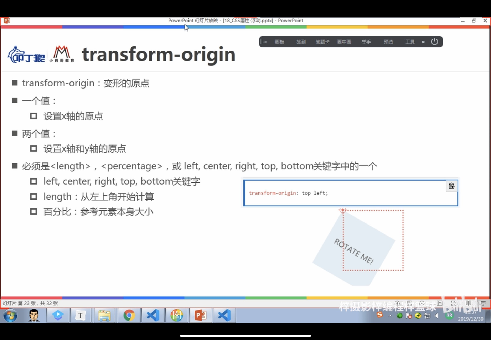
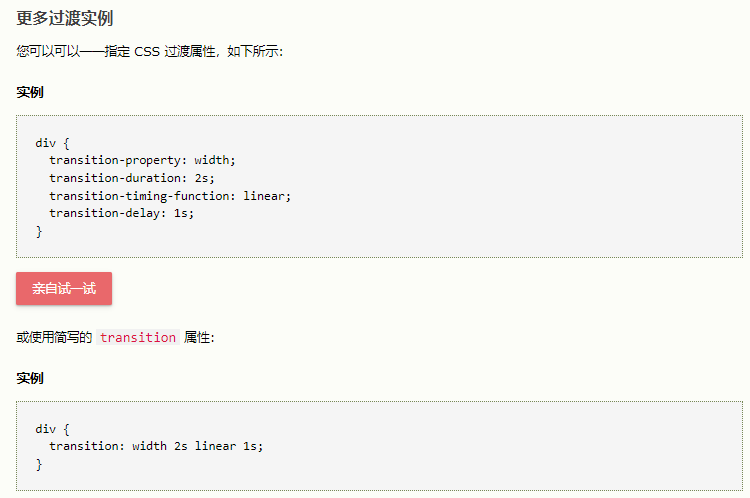
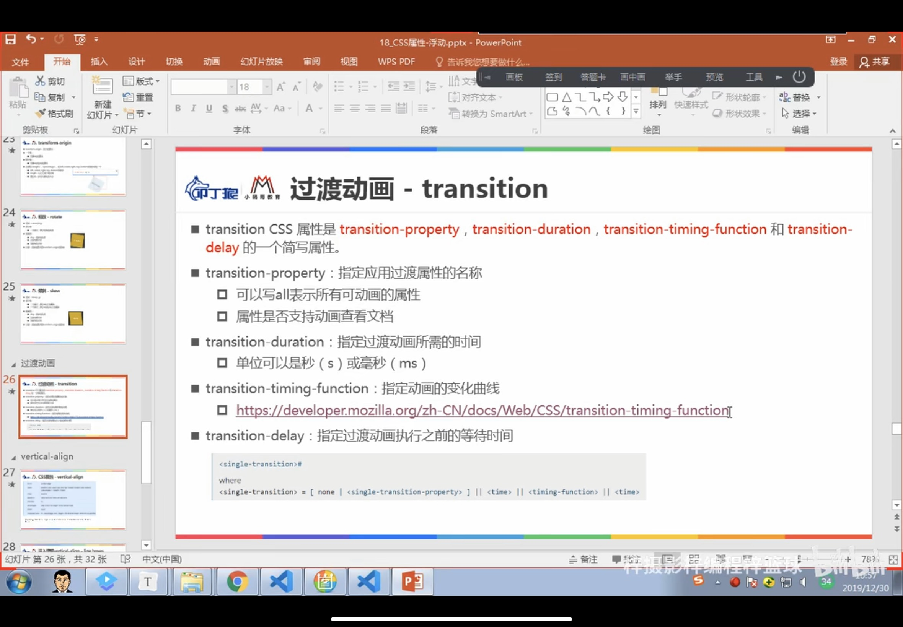
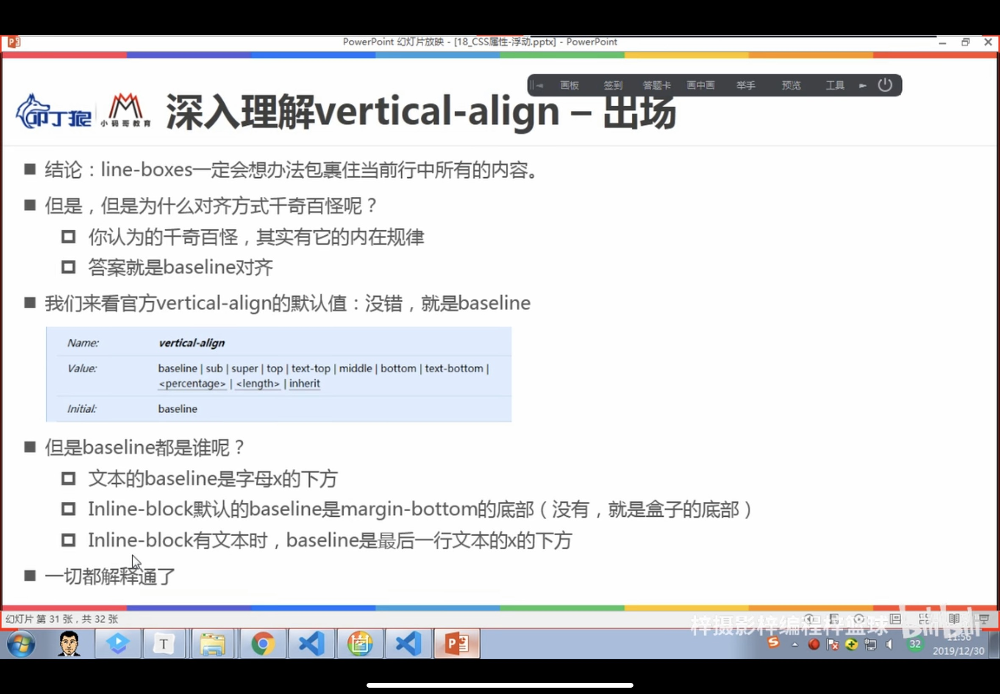
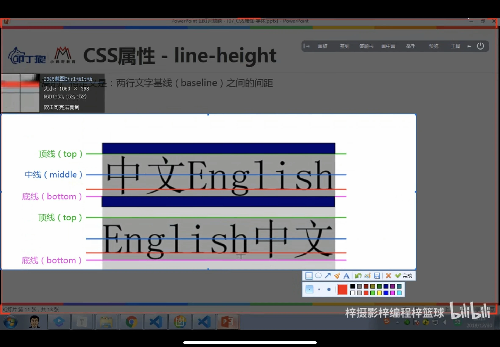

#                                              一、浮动的坍塌

## 1、浮动存在的问题：

由于浮动元素脱离了标准流，变成了脱标元素，所以不再向父元素汇报高度，形成高度坍塌。

## 2、css属性---clear（清除浮动）

**取值**：

* left：要求元素底部低于之前生成的所有左浮动元素的底部。
* right：要求元素底部低于之前生成的所有右浮动元素的底部。
* both：要求元素底部低于之前生成的所有左浮动和右浮动元素的底部。

**如何清除？**

```html
  <br clear="all"> 
```

```css
/*利用伪元素来清除浮动*/
.container::after{
            content: "";
            clear: both; 
            display: block;
        }
/*利用块级元素来清除浮动*/
        .clear-fix{ 
            clear: both; 
        } 
```


# 二、形变和动画

## 1、css属性：transfrom

##### 属性允许你旋转，缩放，倾斜或平移给定元素。（对行内元素无效）

* ##### transform-origin

  

- ##### translate(x, y)（只有一个值时，是x轴上的平移）

  * 方法:从其当前位置移动元素（根据为 X 轴和 Y 轴指定的参数）。
  * x与y的值：
    * 数字：100px
    * 百分比：参照元素本身（refer to the size of bounding box)

- ##### rotate()

  * 方法:根据给定的角度顺时针或逆时针旋转元素。
  * +为顺时针，-为逆时针
  * 值：
    * 数字：-45deg或者+45deg等

- scaleX()

- scaleY()

- ##### scale(x, y)（只有一个值时，是中心点上的缩放）

  * 值：
    * 1:保持不变
    * 2：放大两倍
    * 0.5：缩小一半
    * 注意：不支持百分比

  ```css
  div{
      transform: scale(2, 0.5);
  }
  ```

  

- ##### skewX()

- ##### skewY()

- ##### skew()

  * 方法：使元素沿 X 和 Y 轴倾斜给定角度。
  * 值：
    * 数字：-45deg或者+45deg等（+为顺时针，-为逆时针）

  ```css
  div{
      transform: skew(-45deg);
  }
  ```

  

- matrix(）

  * 方法可接受六个参数，其中包括数学函数，这些参数使您可以旋转、缩放、移动（平移）和倾斜元素。

    参数如下：matrix(scaleX(),skewY(),skewX(),scaleY(),translateX(),translateY())

## 二、transition






# 三、vertical align






# 四、将考拉项目搭建起来

## 4.1、目录结构划分

#### 一定会包括一个文件：index.html

#### css

* reset.css
* commom.css

### 4.2写reset.css相关的东西

版本管理工具：svn/git

### 4.3搭建页面结构和样式


