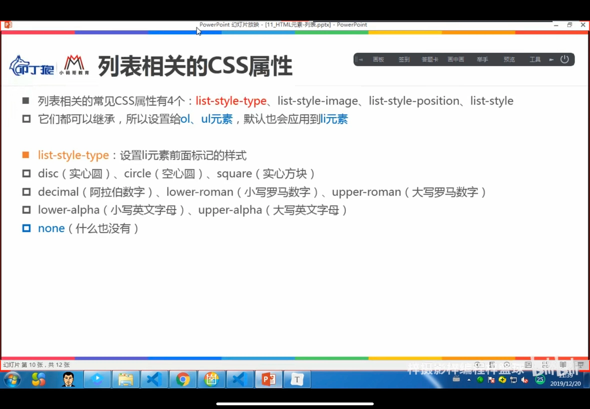
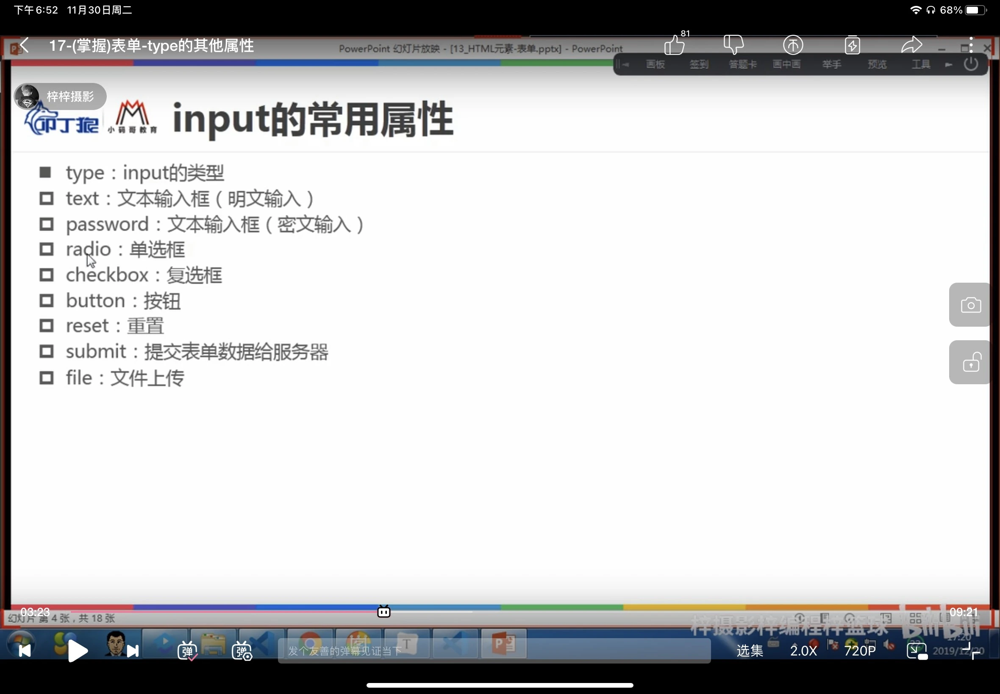
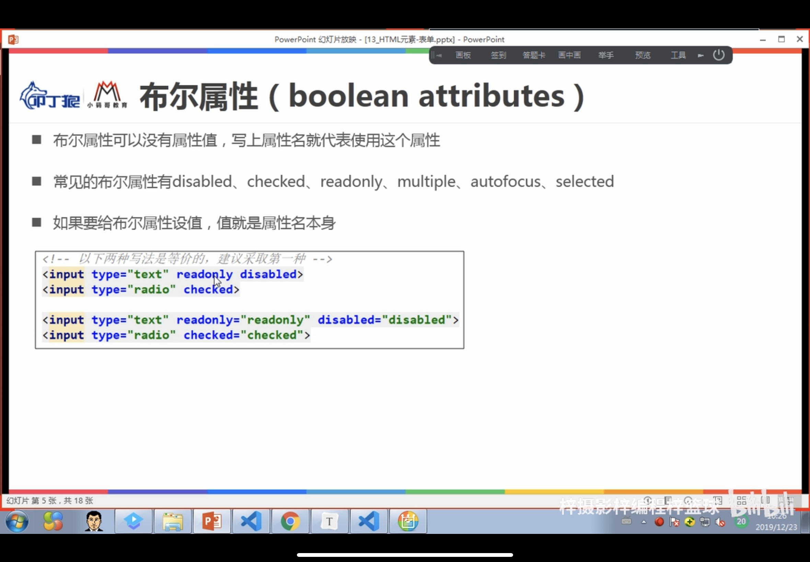
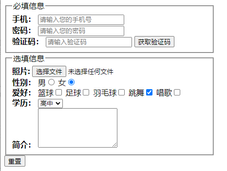
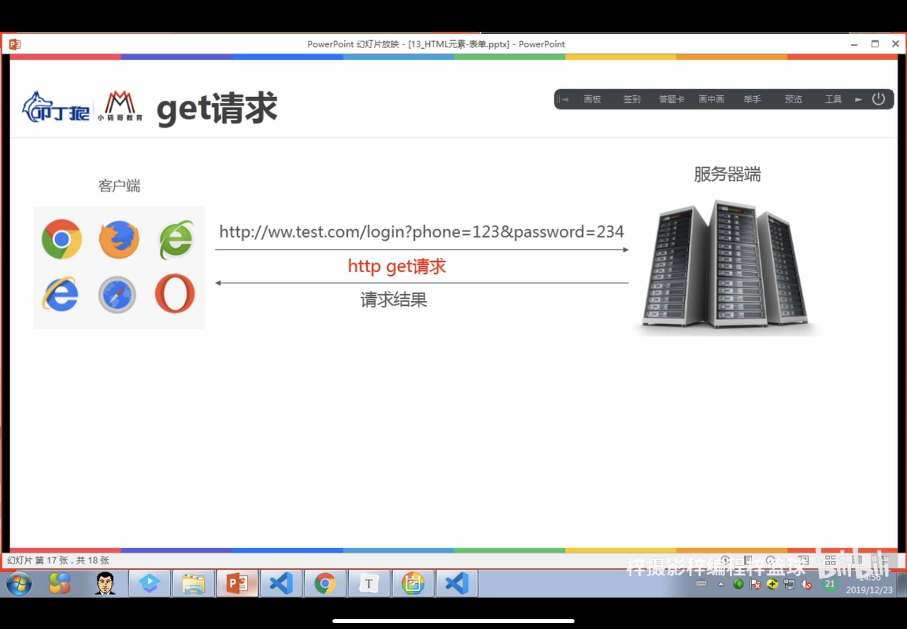
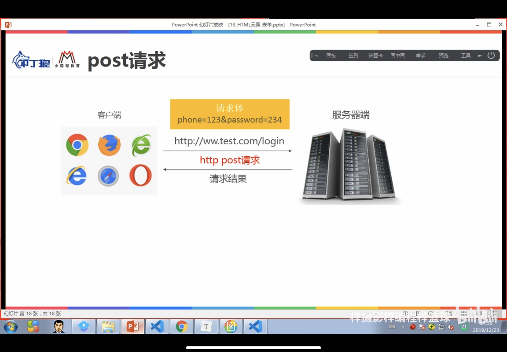
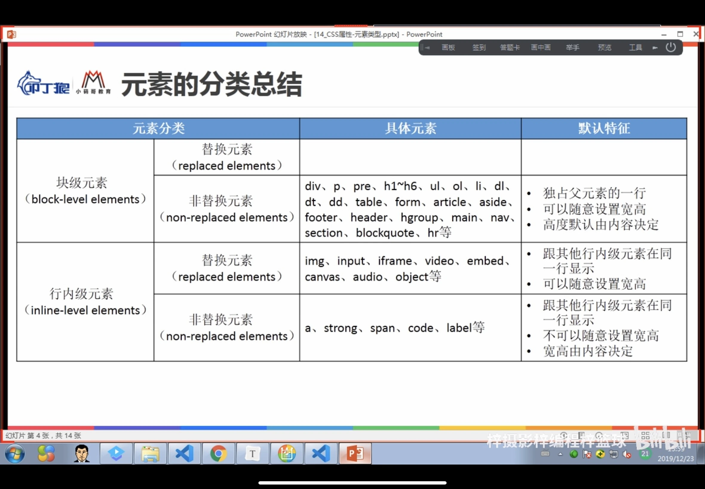

#  内容概述

## 一、css特性

### 1、继承

css中有些属性是可继承的，一些元素如果没有设置某属性的值，就会跟随父元素的值

如：color、font-size都可以继承的

​	* 只要自己有设置属性，肯定用自己的

### 2、层叠

* 基本层叠：选择器相同时，后面的属性会层叠前面的属性
* 优先级、权值（权重） 

！important:10000 声明优先级

​    内联样式：1000

​    id选择器：100

​    类选择器、属性选择器、伪类：10 

如果自己设置了属性，就不能继承了

### 3、优先级

原因如下：

1.选择器优先级太低

2.选择器没选中对应的元素

3.css属性的使用形式不对

* 元素不支持此css属性，比如旧版本的浏览器不支持css3的某些属性
* 浏览器不支持此css属性，比如旧版本的浏览器不支持css3的某些属性
* 被同类型的css属性覆盖，如font属性覆盖font-size


## 二、HTML-列表元素

### 1.ol(ordered list)

有序列表

* 里面只能放li(list item)这个元素

### 2.ul(ordered list)

无序列表

### 3.定义列表dl(definition list )

直接子元素只可以是dt 和dd

* dt(definition term) 列表中每一项的项目名

* dd(definition description) 列表中每一项的具体描述：对dt的描述，结束，补充
  * 一个dt后会有一个或者多个dd

### 4.列表相关css属性

* list-style-type(none用的比较多)




## 三、HTML-表格元素

* table常见元素：

table:表格

tr:表格的一行

td:表格中的单元格

caption:表格的标题

thead:表格的表头 

tfoot:表格的页脚

th:表格表头的单元格

* 单元格边框的合并（细线表格）
  * border-collapse:collapse/segereat
* 单元格的合并
  * colspan
  * rowspan

* border-spacing

## 四、HTML-表单元素

### 1.form:表单

按钮要实现reset，必须在form里面才可以实现。

一般情况下，其他表单相关元素都是他的后代元素

### 2.input

单行文本输入框、单选框、复选框、按钮等元素

明文输入：（type=text)

注意：name值相同的radio才具备单选功能

* checked只用在radio和CheckBox里面
* 其他的要实现默认选项要用selected

    



* ### input的外边框outline

  ```html
  <style>
      /* 去掉input的默认模式 */
      input{
          outline:none;
      }
      /* 设置想要的样式 */
      input:focus{
          border-color:#4791ff;
          border-style:solid;
      }
  </style>
  ```

  去掉input的outline的两种方法

  * outline：none
  * tabindex= -1
  
  

### 3.textarea

多行文本框

cols:列数

rows:行数

缩放的css属性

禁止缩放：

```html
<style>
    textarea{
        /*禁止缩放*/
        resize:none;
        /*水平缩放*/
        resize:horizontal;
        /*垂直缩放*/
        resize:vertical;
        /*水平垂直缩放*/
        resize:both;
    }
</style>
```

例如：

```html
<div>
    <span>简介：</span>
    <textarea cols="20" rows="5"></textarea>
</div>
```


### 4.select、option

#### select的常见属性

multiple:可以多选（会显示出所有的选择）

size:显示多少项(在multiple后使用)


```html
<div>
    <span>学历：</span>
    <select name="" id="" multiple size="2">
    <option value="0">小学</option>
    <option value="1">初中</option>
    <option value="2" selected>高中</option>
    </select>
 </div>
```

#### option的常用属性

selected：默认被选中

### 5.button

按钮

```html
<!-- button实现方式一 -->
<input type="button" value="获取验证码">
<!-- button实现方式二 -->
<button>获取验证码</button>
```


### 6.label

表单元素标题

* label可以和某个input绑定，点击label可以激活对应的input(id和for来实现)

  ``` html
   <div>
          <span>性别：</span>
          <label for="male">男</label>
          <input type="radio" name="sex" id="male" >
          <label for="female">女</label>
          <input type="radio" name="sex" id="female" >
      </div>
      
  ```

  

### 7.fieldset

表单元素组

```html
<fieldset>
    <legend>必填信息</legend>
    <div>
        <span>
            手机：
        </span>
        <!-- text明文输入 -->
        <input type="text" 
               maxlength="11" 
               placeholder="请输入您的手机号"
               autofocus>
    </div>
    <div>
        <span>
            密码：
        </span>
        <!-- 密码输入 -->
        <input type="password" placeholder="请输入您的密码">
    </div>
    <div>
        <span>
            验证码：
        </span>
        <input type="text" placeholder="请输入验证码">
        <!-- button实现方式一 -->
        <input type="button" value="获取验证码">
        <!-- button实现1方式二
		<button>获取验证码</button> -->
    </div>
</fieldset>
```


### 8.legend

fieldset的标题

  表单综合练习效果如下：



```html
<!DOCTYPE html>
<html lang="en">
<head>
    <meta charset="UTF-8">
    <meta http-equiv="X-UA-Compatible" content="IE=edge">
    <meta name="viewport" content="width=device-width, initial-scale=1.0">
    <title>Document</title>
    <style>
        fieldset{
            width:400px ;
        }
        span{
            font-weight: 700;
        }
    </style>
</head>
<body>
    <form>
        <fieldset>
            <legend>必填信息</legend>
            <div>
                <span>
                    手机：
                </span>
                <!-- text明文输入 -->
                <input type="text" 
                       maxlength="11" 
                       placeholder="请输入您的手机号"
                       autofocus>
            </div>
            <div>
                <span>
                    密码：
                </span>
                <!-- 密码输入 -->
                <input type="password" placeholder="请输入您的密码">
            </div>
            <div>
                <span>
                    验证码：
                </span>
                <input type="text" placeholder="请输入验证码">
                <!-- button实现方式一 -->
                <input type="button" value="获取验证码">
                <!-- button实现1方式二
                <button>获取验证码</button> -->
            </div>
        </fieldset>
        <fieldset>
            <legend>选填信息</legend>
            <div>
                <span>照片:</span>
                <input type="file">
            </div>
            <!-- 5.性别选择  radio需要可以单选，必须要加上name
            * name值相同的radio才具备单选功能
            -->
            <div>
                <span> 性别：</span>
                男<input type="radio" name="sex">
                女<input type="radio" name="sex" checked>
            </div>
            <!-- 爱好选择 checkbox可以多选 -->
            <div>
                <span> 爱好：</span>
                篮球<input type="checkbox" name="hobbies">
                足球<input type="checkbox" name="hobbies">
                羽毛球<input type="checkbox" name="hobbies">
                跳舞<input type="checkbox" name="hobbies" checked>
                唱歌<input type="checkbox" name="hobbies">
            </div>
            <!--学历 -->
            <div>
                <span>学历：</span>
                <select name="" id="">
                    <option value="0">小学</option>
                    <option value="1">初中</option>
                    <option value="2" selected>高中</option>
                </select>
            </div>
            <!-- 简介 -->
            <div>
                <span>简介：</span>
                <textarea cols="20" rows="5"></textarea>
            </div>
        </fieldset>
    <!-- 重置按钮 
        前提：1.type必须是reset类型（value可以不写）
             2.所有内容必须在同一个表单中所以必须要用form来包住他
        -->
        <input type="reset">
    </form>
</body>
</html>
```

### 9.表单提交

#### 含义：将用户在input中输入的内容提交给服务器

#### 提交方式1：（传统方式）

#### 步骤：

1、将所用的input包裹到一个form中

2、form中设置action(服务器地址)

3、input/button类型是submit

点击submit会自动将所有的数据传到服务器

#### 弊端：

1、会进行页面的跳转（意味着服务器必须提前将一个页面写好，并且将写好的页面返回到前端，前端直接展示这个页面）

服务器提前讲页面写好：服务端渲染

2、不方便进行表单数据的验证

#### 提交方式2：

#### 前后端分离：

1.通过JS获取到所有表单的内容

2、通过正则表达式进行表单的验证

3、发送ajax请求，将数据传递给服务器

4、验证成功后，服务器会返回结果，需要前端解析这个数据，并决定显示什么内容（前端渲染和前端路由）

### 10.表单提交后

提交表单数据时，浏览器发送的是http请求，有两种请求方式选择:post和get

#### 10.1、get

在请求url后面以？形式跟上发给服务器的参数，多个参数之间用 隔开

如：https://www.baidu.com/?phone=123456&password=123456&sex=on&enducation=2&introdution=%E6%88%91%E4%B9%9F%E4%B8%8D%E7%9F%A5%E9%81%93

由于浏览器和服务器对URL长度有限制，因此在URL后面附带的参数是有限制的，通常不能超过1kb 



#### 10.2、post



### 11、form常用属性

.PNG)

## 五、css元素类型

### 根据元素的显示类型，HTML元素主要分为以下两大类

#### 1、块级元素（block-level elements）

#### 2、行内级元素（inner-block elements）

### 根据元素的内容类型，HTML元素可以主要分为两大类

#### 1、替换元素（replaced elements)

元素本身没有实际内容，浏览器根据元素的类型和属性，来决定元素的具体显示内容

比如img/input/video/emded等

#### 2、非替换元素(non-replaced elements)

元素本身有实际内容，浏览器会直接将内容显示出来，而不需要根据元素类型和属性来判断显示什么内容

比如：div/p/h1-h6/ul等




### css属性-display

display三个属性值：block（将行内级元素变为块级元素）、inline（将block元素变为行内级元素）、none（隐藏元素，不占空间）、inline-block（可以和其他元素在同一行显示、可以设置宽度和高度）

#### 1.邮箱练习

```html
<!DOCTYPE html>
<html lang="en">
<head>
    <meta charset="UTF-8">
    <meta http-equiv="X-UA-Compatible" content="IE=edge">
    <meta name="viewport" content="width=device-width, initial-scale=1.0">
    <title>Document</title>
    <style>
        /* 取消默认样式 */
        ul{
            list-style:none;
            padding:0;
            margin: 0;
        }

        a{
            text-decoration: none;
            color:black;
        }

        /* 设置整体样式 */
        .email{
            border:2px solid #999;
            width:100px;
            text-align:center;
        }
        /* 隐藏邮箱列表 */
        .email:hover ul{
            display:block;
         }

        /* 设置局部样式-header */
        .header{
            background-color: #999;
            color:#fff;
        }

       /* 设置局部样式-邮箱列表 */
       .email ul{
           display:none;
        }
        .email ul li a:hover{
            background-color:skyblue;
        }
        .email ul li a{
            display:block;
        }
        
    </style>
</head>
<body>
    <div class="email">
        <div class="header">邮箱</div>
        <ul>
            <li><a href="">QQ邮箱</a></li>
            <li><a href="">163邮箱</a></li>
            <li><a href="">139邮箱</a></li>
        </ul>
    </div>
</body>
</html>
```


