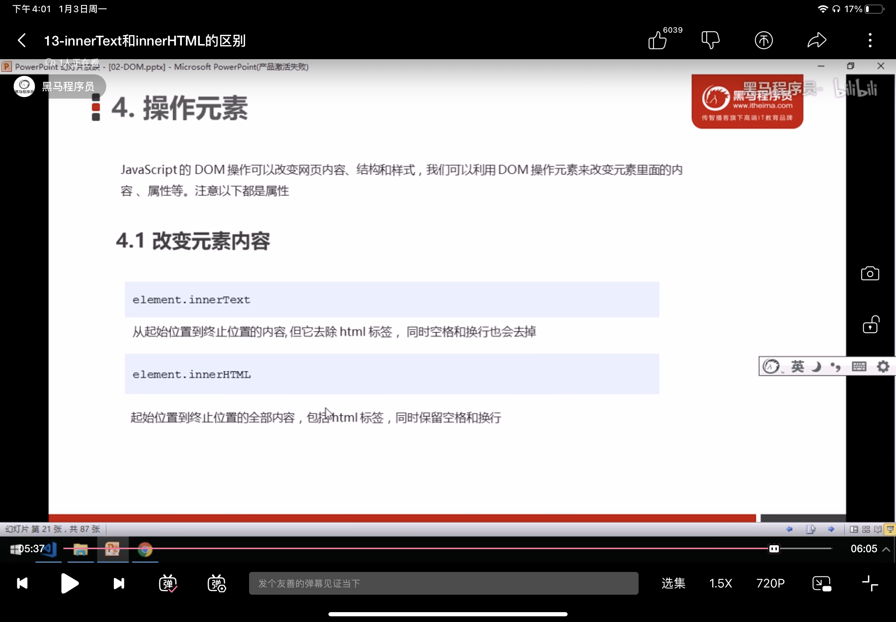

# 一、API和Web API

## 1.定义

一个 API（Application Programming Interface，应用编程接口）是软件（应用）中的一系列特性和规则，这些特性和规则允许其他软件与之交互（与用户界面相对）。API 可被视为提供它的应用与其他软硬件之间的一个简单的合约（接口）。

在 Web 开发中，API 通常是开发者能用在应用（app）中的一系列代码特性（如 [方法](https://developer.mozilla.org/zh-CN/docs/Glossary/Method)、[属性 (en-US)](https://developer.mozilla.org/en-US/docs/Glossary/property)、事件 和 [URL](https://developer.mozilla.org/zh-CN/docs/Glossary/URL)），这些特性被用于与用户的 web 浏览器中的组件、用户电脑上的其他软硬件或者第三方软件与服务交互。


## 2.总结

* API是为我们程序员提供的一个接口，帮助我们实现某种功能。会使用就可以了，不必纠结内部如何实现
* Web API主要是针对浏览器提供的接口，主要针对浏览器做交互效果
* Web API一般都有输入和输出（函数的传参和返回值）Web API很多都是方法（函数）
* 可以结合前面学习内置对象的方法学习

# 二、DOM

## 1、定义

文档对象模型（Document Object Model, 简称为DOM, 是W3C组织推荐的处理可拓展标记语言(html及xml)的标准编程接口

w3c已经定义了一些列的DOM接口，通过这些接口可以改变网页内容及样式；


## 2.获取元素


### 2.1根据id获取

使用getElementById()方法获取带有id的元素对象

```html
  <div id="time">2022-1-3</div>
  <script>
    // 1.文档是从上往下加载，所以必须先有标签
    // 2.驼峰命名法
    // 3.参数id是大小写铭感的字符串
    // 4.返回的是一个元素对象
    var timer = document.getElementById("time");
    console.log(timer);
    console.log(typeof timer); // object

    // console.dir()打印返回的对象，更好的查看里面的方法和属性
    console.dir(timer);
  </script>
```

### 2.2根据标签名获取

* 使用getElementByTagName()方法可以返回带有指定标签名的集合

```html
  <ul>
    <li>知否知否，应是绿肥红瘦</li>
    <li>不知不知，不知绿肥红瘦</li>
    <li>加油加油，你不加油，别人就替你加油</li>
    <li>别人就过你想过的人生</li>
  </ul>
  <script>
    // 1.获取过来是元素对象的集合，以伪数组的形式存储
   var list = document.getElementsByTagName("li");
   console.log(list);
  //  2.想打印里面的元素，可以使用遍历的方法
  // for(var i = 0; i < list.length;i++){
  //   console.log(list[i]);
  // }
  // 3.遍历对象也可以打印元素内容
  for(k in list){
    console.log(list[k]);
  }
  // 4.如果页面只有一个li，返回的还是伪数组的形式
  // 5.如果没有元素，返回的就是一个空的伪数组
  </script>
```

* 只获取ol里的li咋办？ element.getElementsByTagName()

```html
  <ul>
    <li>知否知否，应是绿肥红瘦</li>
    <li>不知不知，不知绿肥红瘦</li>
    <li>加油加油，你不加油，别人就替你加油</li>
    <li>别人就过你想过的人生</li>
  </ul>
  <ol id = "ol">
    <li>生僻字</li>
    <li>生僻字</li>
    <li>生僻字</li>
    <li>生僻字</li>
  </ol>
  <script>
        // 只获取ol里的li咋办？ element.getElementsByTagName() //父元素必须是指定的单个元素
  var ol = document.getElementById("ol");
  var lis = ol.getElementsByTagName("li");
  console.log(lis);

  </script>
```

### 2.3根据类名获得某些元素

```html
  <div class="name">陆一66呀1</div>
  <div class="name">陆一66呀2</div>
  <script>
    // 1. getElementsByClassName("类名") 根据类名获取某些元素集合
    var names = document.getElementsByClassName("name");
    console.log(names);
    // 遍历显示内容
    for(k in names){
      console.log(names[k]);
    }
      
  </script>
```

### 2.4H5新增获取方式

*  querySelector（）返回指定选择器的第一个元素对象

```html
  <div class="name">陆一66呀1</div>
  <div class="name">陆一66呀2</div>
  <script>

    // 2.querySelector 返回指定选择器的第一个元素对象  H5新增的获取方式
    // 切记里面的选择器必须要加符号 类加"." , id加"#".
    var firstBox = document.querySelector(".name");
    console.log(firstBox);
  </script>
```

* querySelectorAll()  返回指定选择器的所有元素对象

```js
    var names = document.querySelectorAll(".name");
    console.log(names);
```

### 2.5获取body元素和html元素

```html
  <div class="box1">box1</div>
  <div class="box2">box2</div>
  <script>
    // 1.获取body元素
    var bodyEle = document.body;
    console.log(bodyEle);
    console.dir(bodyEle);

    // 2.获取html元素
    var htmlEle = document.documentElement;
    console.log(htmlEle);
  </script>
```

## 3.事件基础

### 3.1事件概述

javascript让我们有能力去创建动态页面，而事件是可以被JavaScript1侦测到的行为

触发 -----响应机制

```html
  <bottom id="btn">唐伯虎</bottom>
  <script>
    // 点击一个按钮，弹出对话框
    // 1.事件是有三个部分组成， 事件源 事件类型 事件处理程序  这是事件三要素
    // 1.1 事件源 事件被触发的对象  谁 按钮
    var btn = document.getElementById("btn");
    // 1.2 事件类型 如何触发 什么事件 比如鼠标点击 （onclick) 还是鼠标经过 还是键盘按下
    // 1.3 事件处理程序 通过一个函数赋值的方式 完成
    btn.onclick = function() {
      alert("点秋香");
    }

  </script>
```

### 3.2执行事件的步骤

1.获取事件源

2.注册事件（绑定事件）


3.添加事件处理程序（采用函数赋值的方法）

```html
  <div>123</div>
  <script>
    // 1.获取事件源
    var div = document.querySelector("div");
    // 2.绑定事件源
    // 3.添加事件处理程序
    div.onclick = function(){
      console.log("我被选中了");
    }
  </script>
```

## 4.操作元素

JavaScript的DOM操作可以改变网页的内容，结构和样式，我们可以利用DOM操作元素来改变里面的内容属性


### 4.1改变元素内容

* 使用element.innerText属性来修改内容

```html
 <button>显示当前时间</button>
  <div>某个时间</div>
  <p>123</p>

  <script>
      //格式化时间
    var date = new Date();
    function getTime(date) {
      var y = date.getFullYear();
      var m = date.getMonth() + 1;
      m = m < 10?"0" + m: m;
      var d = date.getDate();
      var w = date.getDay();
      week = ["天", "一", "二", "三", "四", "五","六"];
      var h = date.getHours();
      h = h < 10?"0" + h: h;
      var min = date.getMinutes();
      min = min < 10?"0" + min: min;
      var s = date.getSeconds();
      s = s < 10?"0" + s: s;

      return y + "年" + m +"月" + d + "日 "+"星期" + week[w] + " " + 
      h + ":" + min + ":" + s;
    }
      
      
    // 当我们点击按钮 div里面的内容会发生变化
    var btn = document.querySelector("button");
    var div = document.querySelector("div");
    btn.onclick = function() {
      div.innerText = getTime(date);
    }
    var p = document.querySelector("p");
    p.innerText = getTime(date);
 

  </script>
```

* innerText()与innerHTML()的区别



### 4.2修改元素属性

```html
 <div>上午好</div>
  
  <script>
    var div = document.querySelector("div");
    var img = document.querySelector("img");
    var time = new Date();
    console.log(time);
    var h = time.getHours();
    console.log(h);
    if (h < 12) {
      div.innerText = "亲，上午好";
      img.src = "../../../图片可爱/上午好.jpeg";
    }
    else if(h <= 18) {
      div.innerText = "亲，中午好";
      img.src = "../../../图片可爱/太阳.gif";

    }
    else{
      div.innerText = "亲，下午好";
      img.src = "../../../图片可爱/下午好.webp";
    }
  </script>
```

### 4.3修改表单属性

```html
  <button>按钮</button>
  <input type="text" value="输入内容">
  <script>
    // 1.获取元素
    var btn = document.querySelector("button");
    var input = document.querySelector("input");

    // 2.注册元素 处理程序
    btn.onclick = function() {
      // 表单里面的文字内容通过value来更改
      input.value = "被点击了";
      // 如果想要表单被禁用 则使用disabled
      this.disabled = true;
      // this指事件函数的调用者
    }
  </script>
```

### 4.4样式属性修改

可以通过js修改元素的大小，颜色，位置等样式

注意

* js里面的样式采取驼峰命名法比如：fontSize  backgroundColor
* js修改style 样式操作，产生的是行内样式，css权重比价高

```html
<!DOCTYPE html>
<html lang="en">
<head>
  <meta charset="UTF-8">
  <meta http-equiv="X-UA-Compatible" content="IE=edge">
  <meta name="viewport" content="width=device-width, initial-scale=1.0">
  <title>Document</title>
  <style>
    div{
      width: 300px;
      height: 100px;
      background-color: pink;
      border: 1px solid #ff1e32;
    }
  </style>
</head>
<body>
  <div></div>
    <!-- 修改 -->
  <script>
    // 1.获取元素
    var div = document.querySelector("div");
    // 2.注册事件
    div.onclick = function() {
      // div.style 里面的属性采取驼峰命名法
      this.style.backgroundColor = "#1110ff";
      this.style.width = "400px";
    }
  </script>
</body>
</html>
```

### 4.5作业--开关灯效果

```html
<!DOCTYPE html>
<html lang="en">
<head>
  <meta charset="UTF-8">
  <meta http-equiv="X-UA-Compatible" content="IE=edge">
  <meta name="viewport" content="width=device-width, initial-scale=1.0">
  <title>Document</title>
</head>
<body>
  <button>开关灯</button>
  <script>
    var btn = document.querySelector("button");
    var body = document.body;
    var flag = 0;

    btn.onclick = function() {
      if(flag == 0) {
        body.style.backgroundColor = "white";
        flag = 1;
      } else {
        body.style.backgroundColor = "black";
        flag = 0;
      }
    }
  </script>
</body>
</html>`
```


