# 一、排他思想

```html
<!DOCTYPE html>
<html lang="en">
<head>
  <meta charset="UTF-8">
  <meta http-equiv="X-UA-Compatible" content="IE=edge">
  <meta name="viewport" content="width=device-width, initial-scale=1.0">
  <title>Document</title>
  <style>
    button{
      border: none;
      width: 50px;
      height: 30px;

    }
  </style>
</head>
<body>
  <button>按钮1</button>
  <button>按钮2</button>
  <button>按钮3</button>
  <button>按钮4</button>
  <button>按钮5</button>
  <script>
    var btns = document.getElementsByTagName("button");
 
    for(var i = 0; i < btns.length; i++) {
     
      btns[i].onclick = function(){
        // 把所有按钮颜色去掉
          for(var i = 0; i < btns.length; i++){
            btns[i].style.backgroundColor = "";
          }
          // 实现其中一个按钮颜色
          this.style.backgroundColor = "#ff1e32";
      }
    }
  </script>
</body>
</html>
```

## 1.1百度换皮肤

```html
<!DOCTYPE html>
<html lang="en">
<head>
  <meta charset="UTF-8">
  <meta http-equiv="X-UA-Compatible" content="IE=edge">
  <meta name="viewport" content="width=device-width, initial-scale=1.0">
  <title>Document</title>
  <style>
    ul,li {
      margin: 0 ;
      padding: 0;  
    }

    body{
      background: url(../../笔记/js/bom/img/百度换肤/boniu.jpg) no-repeat center top;
      background-size: 100%;
    }

    ul {
      width: 450px;
      /* padding-top: 3px; */
      margin: 100px auto;
      background-color: #fff;

      display: flex;
      justify-content: space-evenly;
      
    }

    li{
      display: inline-block;
      list-style-type: none;
    }
    ul li img {
      width: 100px;
      vertical-align: middle; 
      padding: 5px 0;
    }
  </style>
</head>
<body>
  <ul>
    <li></li>
    <li></li>
    <li></li>
    <li></li>
  </ul>
  <script>
    var lis = document.querySelector("ul").querySelectorAll("img");
    var body = document.body;
    for (var i = 0; i < lis.length; i++) {
      lis[i].onclick = function(){
        body.style.backgroundImage = "url("+ this.src +")";
        for(var i = 0; i < lis.length; i++){
          lis[i].style.transform = "scale(1)";
          }
        this.style.transform = "scale(1.1)";
      }
    }
  </script>
</body>
</html>
```

## 1.2购物车全选和单选

```html
<!DOCTYPE html>
<html lang="en">
<head>
  <meta charset="UTF-8">
  <meta http-equiv="X-UA-Compatible" content="IE=edge">
  <meta name="viewport" content="width=device-width, initial-scale=1.0">
  <title>Document</title>
  <style>
    td,th{
      outline: 0.5px solid #999;
      border-collapse: collapse;
      width: 100px;
      text-align: center;
    }
    thead{
      background-color: rgba(20,25,255,0.5);
      color: #fff;
    }

  </style>
</head>
<body>
  <div class="wrap">
    <table>
      <thead>
        <tr>
          <th>
            <input type="checkbox" id="tb_h">
          </th>
          <th>商品</th>
          <th>价钱</th>
        </tr>
      </thead >
      <tbody id="tb">
        <tr>
          <td>
            <input type="checkbox">
          </td>
          <td>iphone11</td>
          <td>8099</td>
        </tr>
        <tr>
          <td>
            <input type="checkbox">
          </td>
          <td>iphone8</td>
          <td>8000</td>
        </tr>
        <tr>
          <td>
            <input type="checkbox">
          </td>
          <td>iphone6</td>
          <td>6000</td>
        </tr>
      </tbody>
    </table>
  </div>
  <script>
    // 获取元素
    var tb_h = document.getElementById("tb_h");//全选按钮
    var tb = document.getElementById("tb").getElementsByTagName("input"); //下面所有的复选框

    // 注册事件
    tb_h.onclick = function() {
      // this.checked 可以得到当前复选框的选中状态，如果是TURE,就是选中，如果不是，就是false
      // 1.让下面的复选框跟随全选的复选框
      for(var i = 0; i < tb.length; i++) {
        tb[i].checked = this.checked;
      }
    }

    // 2.下面的复选框全部选中，上面全选才可以选中
      for(var i = 0; i < tb.length; i++) {
          tb[i].onclick = function() {
              var flag = true;
              for(var i = 0; i < tb.length; i++) {
                  if(tb[i].checked == false) {
                      flag = false;
                      break;//提高循环执行的效率
                  }
              }
              tb_h.checked = flag;
          }
      }
      
      //第二种方法
      for(var i = 0; i < tb.length; i++) {
          tb[i].onclick = function() {
              tb_h.checked = true;
              for(var j = 0; j < tb.length; j++) {
                  if(!tb[j].checked) {
                      tb_h.checked = false;
                      break;//提高循环执行的效率
                  }
              }
          }
      }
  </script>
</body>
</html>
```

二、自定义属性操作

element.属性

增加属性：element.setAttribute("属性"，“值”)

删除属性：element.removeAttribute("属性"，“值”)

## 2.1获取元素属性

注意两种获取元素属性的方法对class有区别

```html
<body>
  <div class="left" id="demo" index="l66">1234</div>
  <script>
    var div = document.querySelector("div");
    // 1.获取元素属性值：
    // 1.1 element.属性 获取的是元素自带的属性
    console.log(div.id)
    console.log(div.className);
    // 1.2 element.getAttribute("属性"，“值”) 标准 这个可以获取自定义属性
    console.log(div.getAttribute("id"));
    console.log(div.getAttribute("class"));
    // 以上两个是元素自带的属性，index是自定义的属性，要用getAttribute获得
    console.log(div.getAttribute("index"));
  </script>
</body>
```

## 2.2设置元素属性值

```js
    // 2.设置元素属性值
    // 2.1 element.属性 = “值”；
    div.id = "lost";
    console.log(div.getAttribute("id"));
    // 2.1 element.setAttribute("属性"，“值”) 主要针对自定义属性
    div.setAttribute("index","l77");
    div.setAttribute("class","classRight");
    console.log(div.getAttribute("class"));
    console.log(div.getAttribute("index"));
```

## 2.3移除属性

```js
    // 3.移除属性
    div.removeAttribute("index");
```

# 二、节点操作

## 2.1为什么使用节点操作

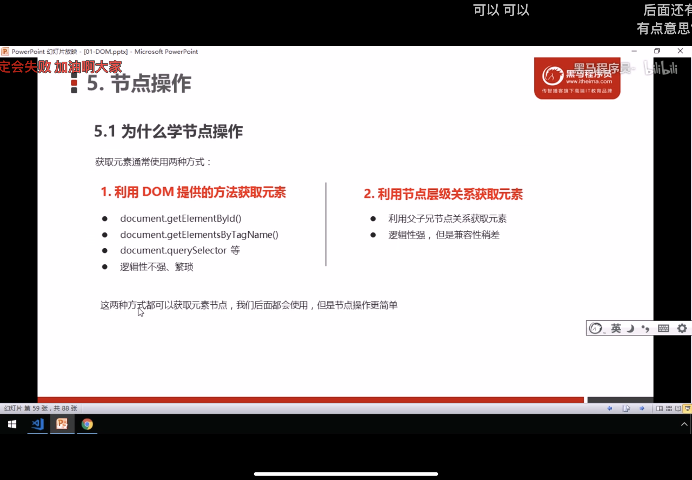

## 2.2节点概述

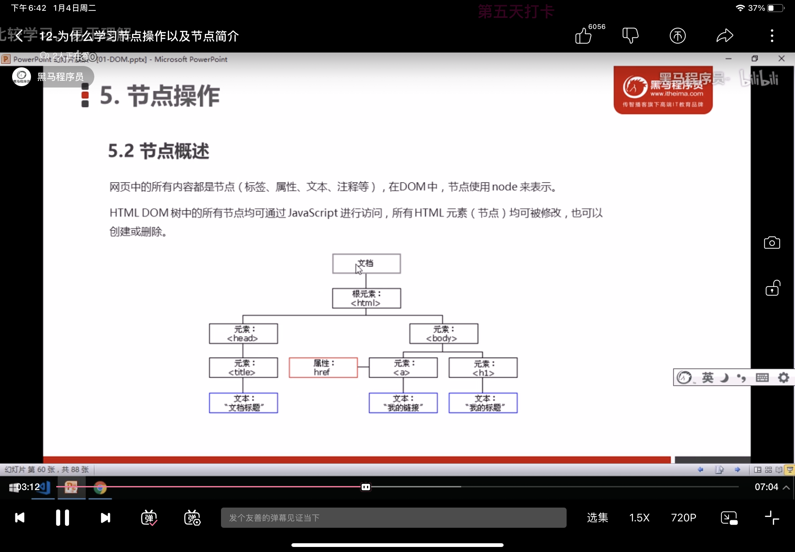

## 2.3节点层次

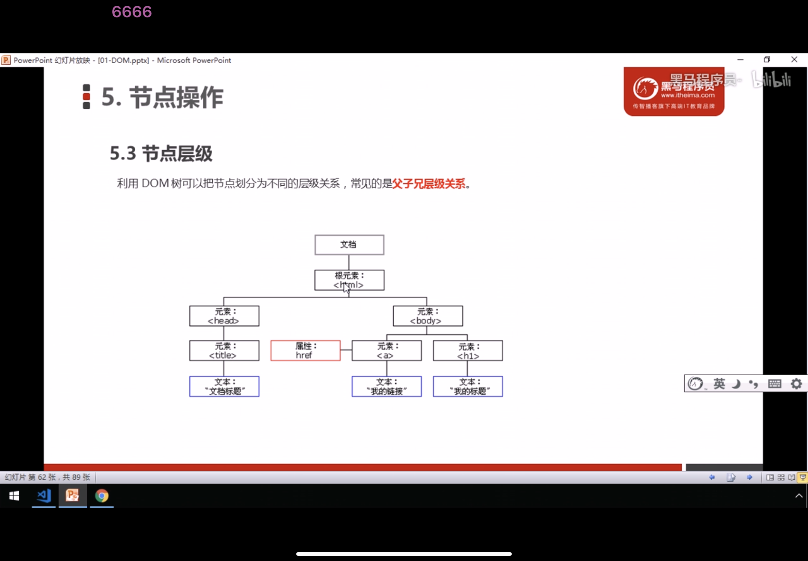

### 2.3.1父子节点

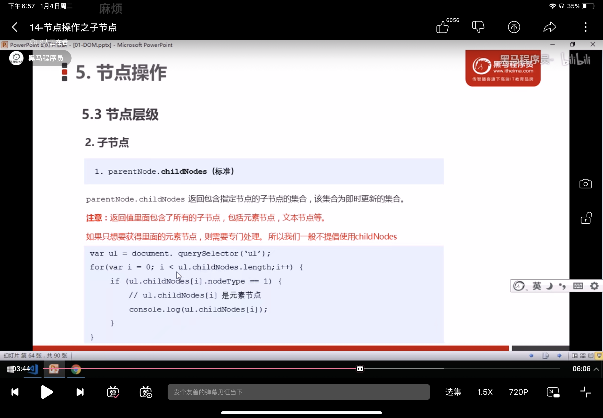

```html
    // 1.父节点 parentNode
    var erweima = document.querySelector(".erweima");

    // 得到的是离元素最近的父级节点
    console.log(erweima.parentNode);
    // 2.子节点 childNodes 所有的节点，包括元素节点和文本节点等
    var ul = document.querySelector("ul");
    console.log(ul.childNodes);

    // 3.子元素节点 children
    console.log(ul.children);

    // 4.firstChild 第一个子节点（元素或者文本）
    //  lastChild 最后一个子节点（元素或者文本）
    console.log(ul.firstChild);
    console.log(ul.firstElementChild);
    console.log(ul.lastChild);
    console.log(ul.lastElementChild);

    // 5.实际开发的写法
    // 第一个子元素和最后一个子元素
    console.log(ul.children[0]);
    console.log(ul.children[ul.children.length - 1]);
  </script>
```


### 2.3.2兄弟节点

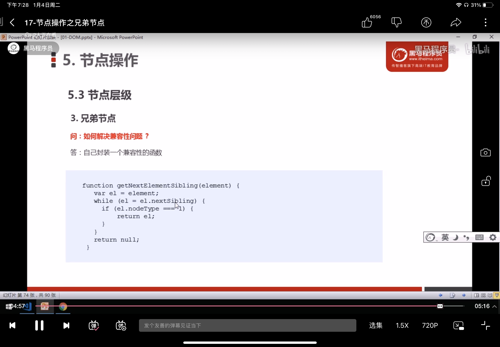

```html
  <div>div元素</div>
  <span>SPAN元素</span>

  <script>
    var div = document.querySelector("div");

    // 打印他的下一个兄弟节点
    console.log(div.nextSibling);//#text
    // 打印下一个元素兄弟节点
    console.log(div.nextElementSibling);// <span>SPAN元素</span>
    // 打印上一个兄弟节点
    console.log(div.previousSibling); // #text
    // 打印上一个元素兄弟节点
    console.log(div.previousElementSibling); // null

    // i9以上才兼容

  </script>  <div>div元素</div>
  <span>SPAN元素</span>

  <script>
    var div = document.querySelector("div");

    // 打印他的下一个兄弟节点
    console.log(div.nextSibling);//#text
    // 打印下一个元素兄弟节点
    console.log(div.nextElementSibling);// <span>SPAN元素</span>
    // 打印上一个兄弟节点
    console.log(div.previousSibling); // #text
    // 打印上一个元素兄弟节点
    console.log(div.previousElementSibling); // null

    // i9以上才兼容

  </script>
```

### 2.3.3创建并添加节点

```html
  <textarea name="" id="" cols="30" rows="10"></textarea>
  <button>发布</button>
  <ul></ul>
  <script>
    var btn = document.querySelector("button");
    var text = document.querySelector("textarea");
    var ul = document.querySelector("ul");
    var date = new Date();

    btn.onclick = function(){
      if(text.value == ""){
        alert("您没有输入内容");
      }
      else{
        // 1.创建元素
        var li = document.createElement("li");
        var time = document.createElement("p");
        li.innerHTML = text.value;
        time.innerHTML = date;
        time.style.display = "inline-block";
        time.style.color = "#999";
        time.style.fontSize = "12PX";
        time.style.margin = "10px";

        // 2.添加元素
        // 2.1往后添加元素
        // ul.appendChild(li);

        // 2.2往前添加元素
        // ul.insertBefore(time,ul.children[0])
        ul.insertBefore(li,ul.children[0])
        li.appendChild(time);
      }
    }
```

### 2.3.4删除节点

**node.removeChild(child)**方法删除一个字节点，返回删除的节点

```html
  <button>删除</button>
  <ul>
    <li>1</li>
    <li>2</li>
    <li>3</li>
    <li>4</li>
  </ul>
  <script>
    // 1.获取元素
    var  ul = document.querySelector("ul");
    var btn = document.querySelector("button");
    // 2.删除元素 node.removeChild(child)
    btn.onclick = function(){
      if (ul.children[0]){
        ul.removeChild(ul.children[0]);
      }
    }

  </script>
```

### 2.3.5复制节点

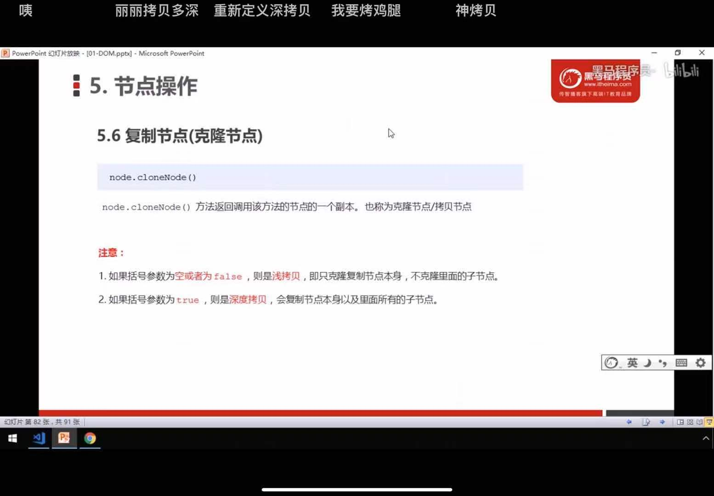

```html
  <ul>
    <li>1</li>
    <li>2</li>
    <li>3</li>
    <li>4</li>
  </ul>
  <script>
    var ul = document.querySelector("ul");
    // 克隆元素 node.cloneNode(); 括号为空或者里面是false 浅拷贝 只复制标签不复制里面的内容
    // 深拷贝 把里面的内容也拷贝进去 node.cloneNode(true)
    let li1 = ul.children[1].cloneNode(true);
    // 添加元素
    ul.appendChild(li1);  // <li> 2 </li>
  </script>
```

## 2.4案例--动态生成表格

```html
<!DOCTYPE html>
<html lang="en">
<head>
  <meta charset="UTF-8">
  <meta http-equiv="X-UA-Compatible" content="IE=edge">
  <meta name="viewport" content="width=device-width, initial-scale=1.0">
  <title>Document</title>
  <style>
    table{
      width: 500px;
      margin: 100px auto;
      border-collapse: collapse;
      text-align: center;
     
    }

    td, th{
      border: 1px solid #333;
    }

    thead tr {
      height: 40px;
      background-color: #ccc;
    }
  </style>
</head>
<body>
  <table  cellspacing="0">
    <thead>
        <tr>
          <th>姓名</th>
          <th>科目</th>
          <th>成绩</th>
          <th>操作</th>
        </tr>
    </thead>
    <tbody>

    </tbody>
  </table>

  <script>
    var datas = [{
        name: "魏璎珞",
        subject: "javascript",
        score: 100,
      },{
        name: "弘历",
        subject: "javascript",
        score: 98,
      },{
        name: "傅恒",
        subject: "javascript",
        score: 99,
      },{
        name: "明玉",
        subject: "javascript",
        score: 99,
      },{
        name: "大猪蹄子",
        subject: "javascript",
        score: 0,
      }
    ]
    // 往tbody里面创建行
    var tbody = document.querySelector("tbody")
    for(let i = 0; i < datas.length; i++) {
      // 创建tr行
     let tr = document.createElement("tr");
      // 添加tr行
      tbody.appendChild(tr);
      for(let k in datas[i]){
        // 创建并添加单元格
        let td = document.createElement("td");
        tr.appendChild(td);
        // 赋值
        td.innerHTML = datas[i][k];
      }
      // 创建有删除的单元格
      let td = document.createElement("td");
      tr.appendChild(td);
      td.innerHTML = "<a href='#'>删除</a>";
    }

    // 删除操作开始
    var as = document.querySelectorAll("a");
    for(let i = 0; i < as.length; i++) {
      as[i].onclick = function() {
        tbody.removeChild(this.parentNode.parentNode);
      }
    }
  </script>
</body>
</html>
```

## 2.5节点操作

### 2.5.1三种动态创建元素区别

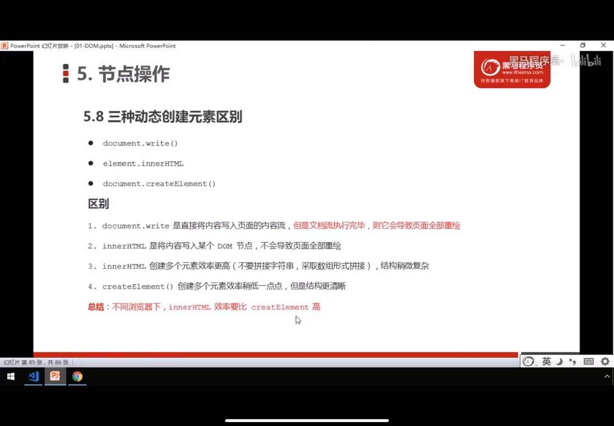

# 三、DOM总结

## 1、dom核心重点

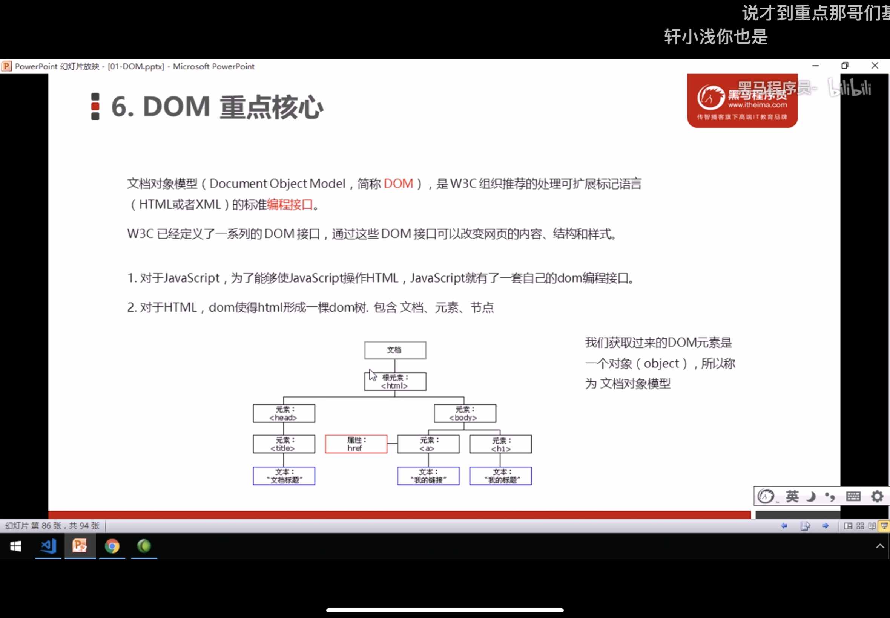

## 2、创建

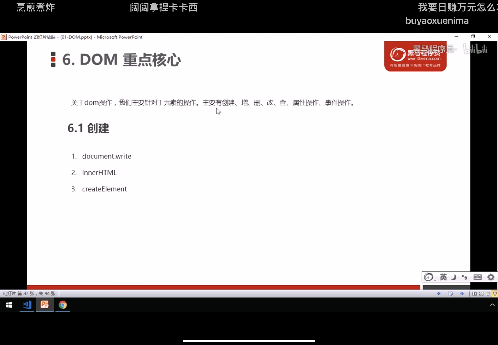

## 3.增

### 3.1、appendChild（）

### 3.2、insertbefore（）

## 4.删

### 4.1removeChild

## 5.改

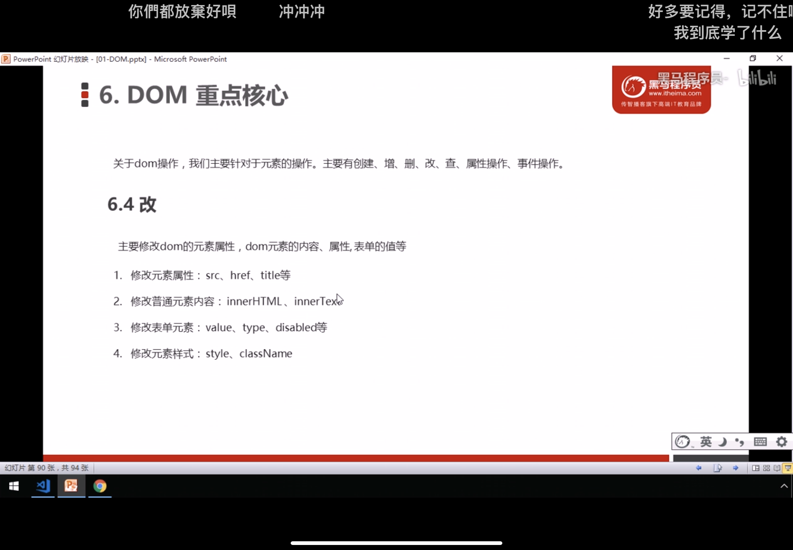

## 6.查

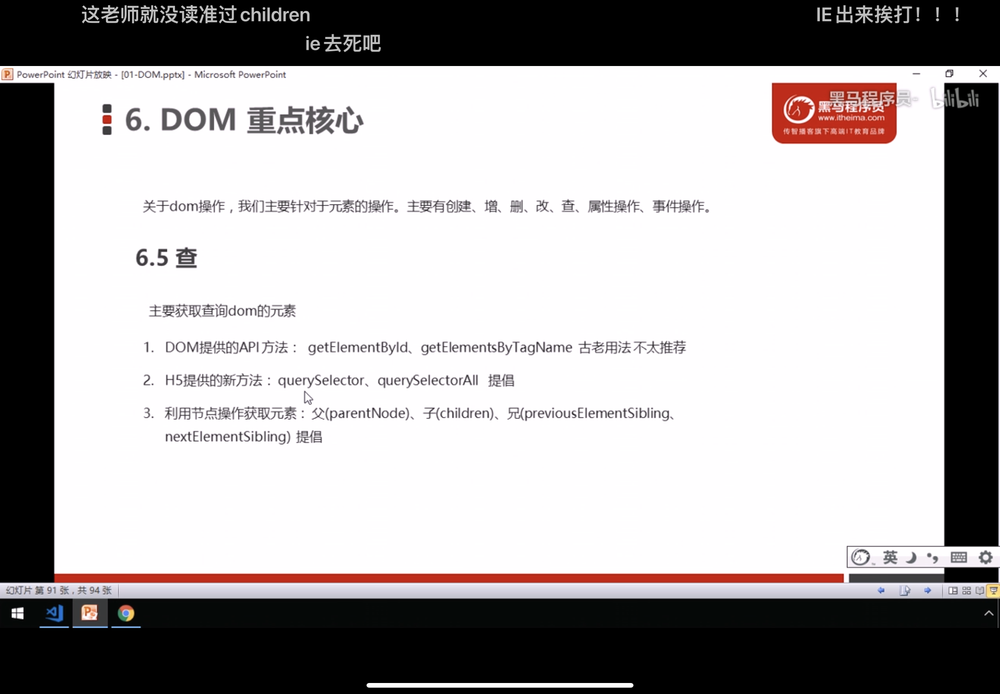

## 7.属性操作

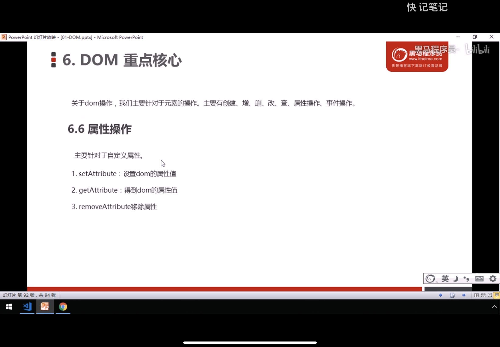

## 8.事件操作

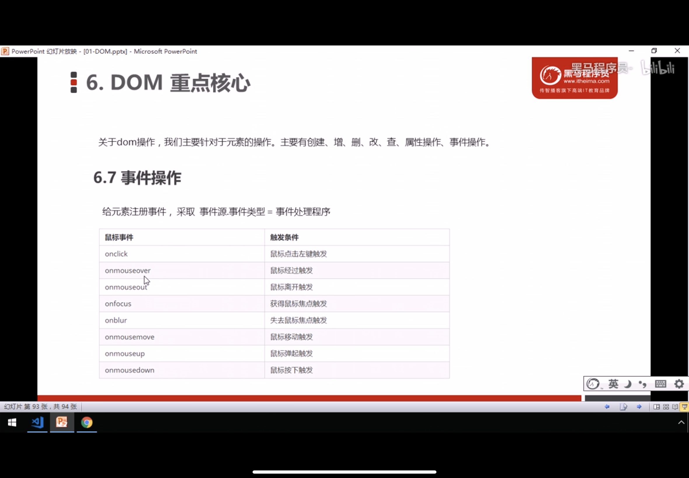

