# 一、运算符

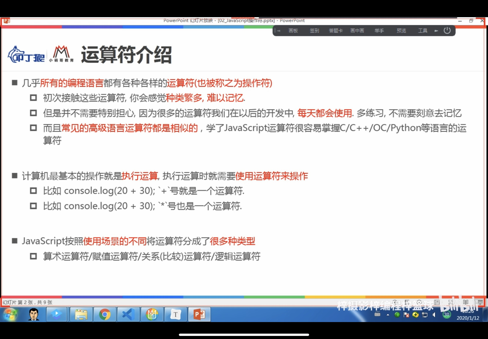

## 1、算术运算符

##### 特别要注意自增自减前置后置的区别

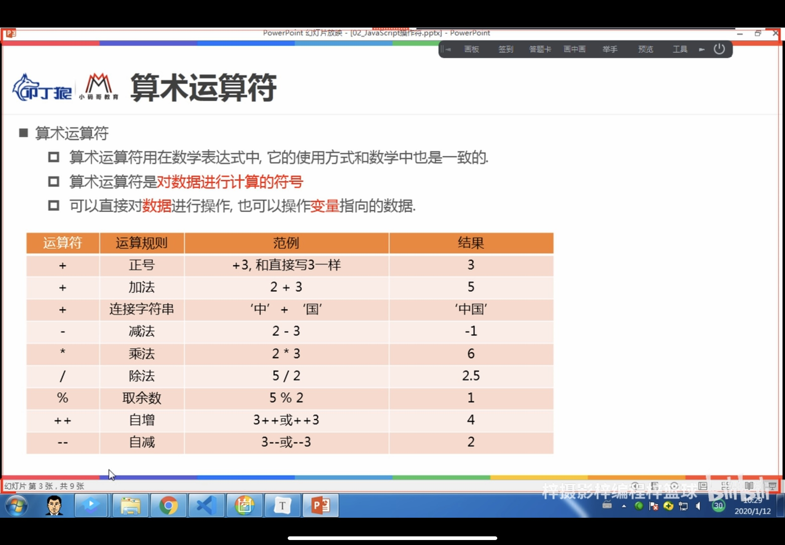

```js
        // 1.定义一些变量
        var num1 = 20;
        var num2 = 30;
        var str1 = "hello";
        var str2 = "66呀";

        // 2.+
        console.log(num1 + num2);// 50
        console.log(str1 + str2); // hello66呀
        console.log(str1 + " " + str2); // hello 66呀
        console.log(str1, str2); // hello 66呀

        // 3.-
        console.log(num1-num2); //-10
        console.log(str1-str2); // NaN

        // 4.*
        console.log(num1 * num2); // 600

        // 5./
        console.log(num1 / num2); //0.6666666……

        // 6.%
        console.log(num1 % num2); //20

        // 7.自增:需要用在数字变量里面
        num1++;  // 后置写法  显示20下次用变成21
        ++num2;  //前置写法  显示31
        console.log(num1, num2);// 21  31
        console.log(num1++, ++num1);// 21  23
        console.log(++num1, num1++);// 24  24
        // 前置后置的区别
        // 1.num1++: 先使用，后自身在+1;
        // ++num1: 先自身+1，再使用;

        // 练习：
        console.log(num1++ + num1++);//25+26=51
```

### 2、赋值运算符

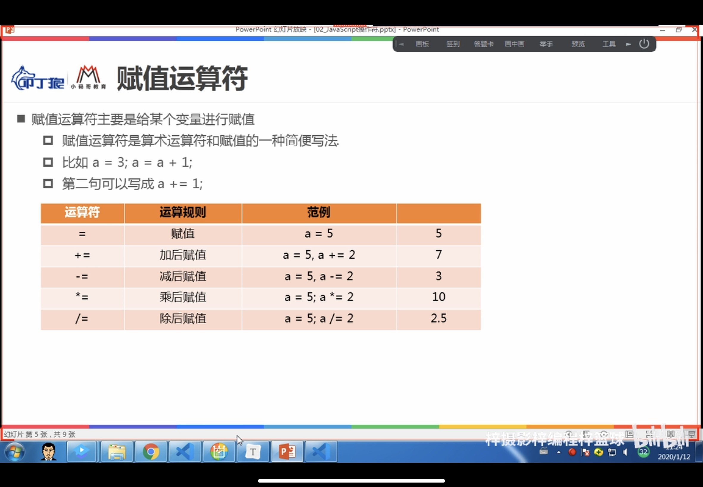

### 3、关系（比较）运算符

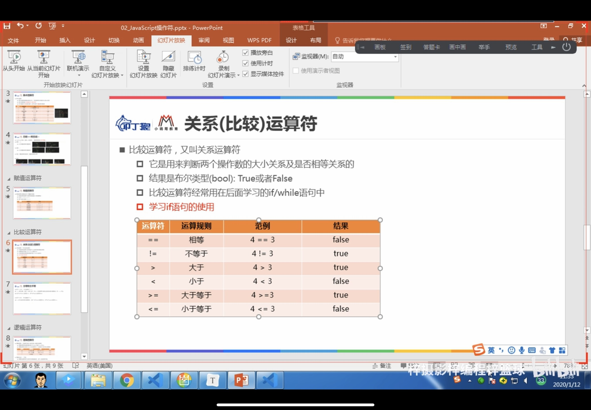

* 全等和全不等会做一个隐式转化，将两个被比较的值转换为相同的类型，下例子中，num2被转换为数字型

```js
var num1 = 123;
var num2 = "123";

console.log(num1 == num2);// true
console.log(num1 === num2);// false ===必须类型相同，数据相等
console.log(num1 !== num2);// true
```

* 注意:都转换为数字类型再比较

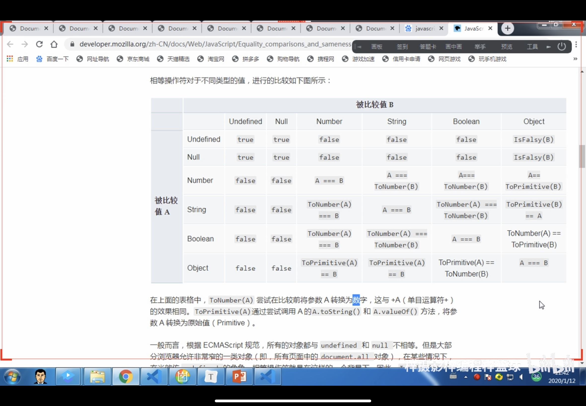

```js
var flag1 = true;
var flag2 = "true";
// 隐式转换：都换成number再比较；
// flag1 -> 1;
// flag2 -> NaN;
console.log(flag1 == flag2);//false
```

### 4、逻辑运算符

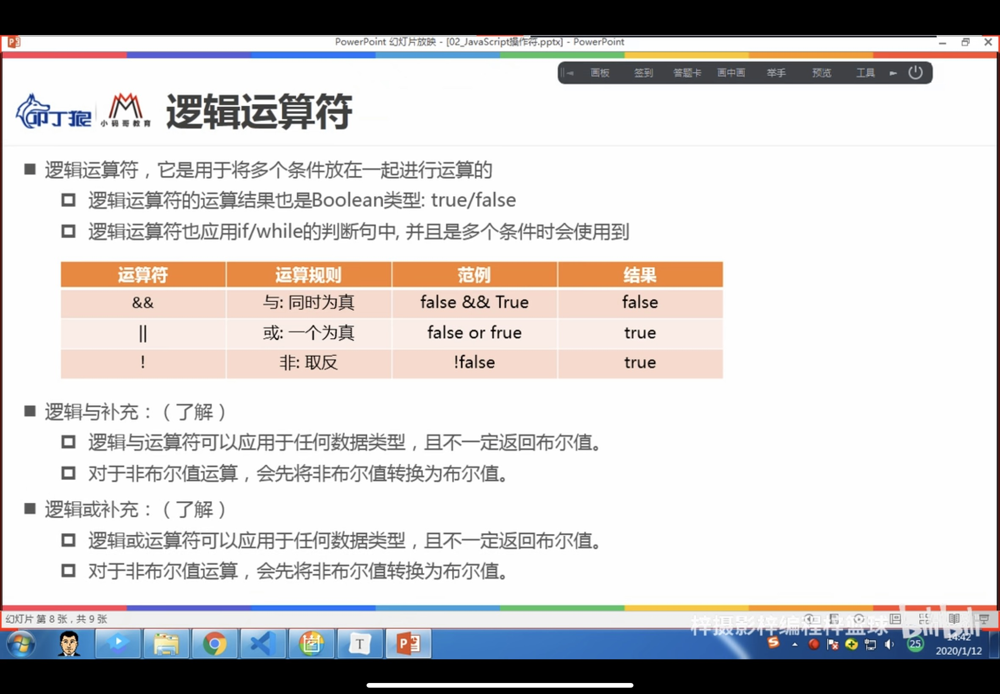

#### 4.1、与

```js
var age = 10;
var money = 10;

// 与：&& 两个同时为真
if(age >= 18 && money >=5) {
    console.log("开机");
    console.log("登录");
    console.log("玩游戏");
}

else{
    console.log("未成年不能进网吧");
}
```

#### 4.2、或

```js
var age = 10;
var money = 10;

// 或: || 其中一个为真
if(age >= 18 || money >=5) {
    console.log("开机");
    console.log("登录");
    console.log("玩游戏");
}

else{
    console.log("未成年不能进网吧");
}
```

# 二、程序的执行语句

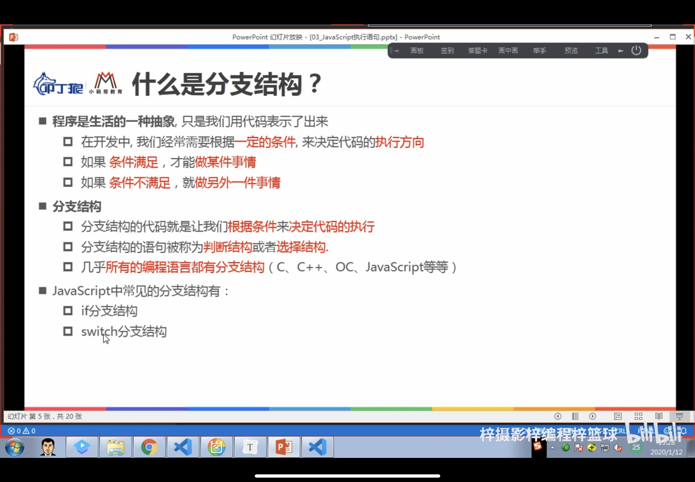

### 1、顺序

### 2、分支

#### 2.1、if分支

```js
var score = prompt("小明，请输入你的分数");
console.log(score, typeof score);

if (score >= 90) {
    console.log("去游乐场");
}
```

#### 2.2、if-else分支

```js
var price = 5;
var weight = prompt("请输入斤数")
var money = price * weight;

if (weight < 5) {
               console.log("您需要支付:",money,"元");
}

else {
    console.log("您需要支付:",money - 8,"元")
}
```

#### 2.3、if-else if分支

```js
var holiday_name = prompt("请输入节日名字");

if (holiday_name == "情人节") {
    console.log("买玫瑰、看电影");
}

else if (holiday_name == "平安夜") {
    console.log("买苹果、吃大餐");
}

else if (holiday_name == "生日会") {
    console.log("买蛋糕、开party");
}

else {
    console.log("上班工作");
}  00
```

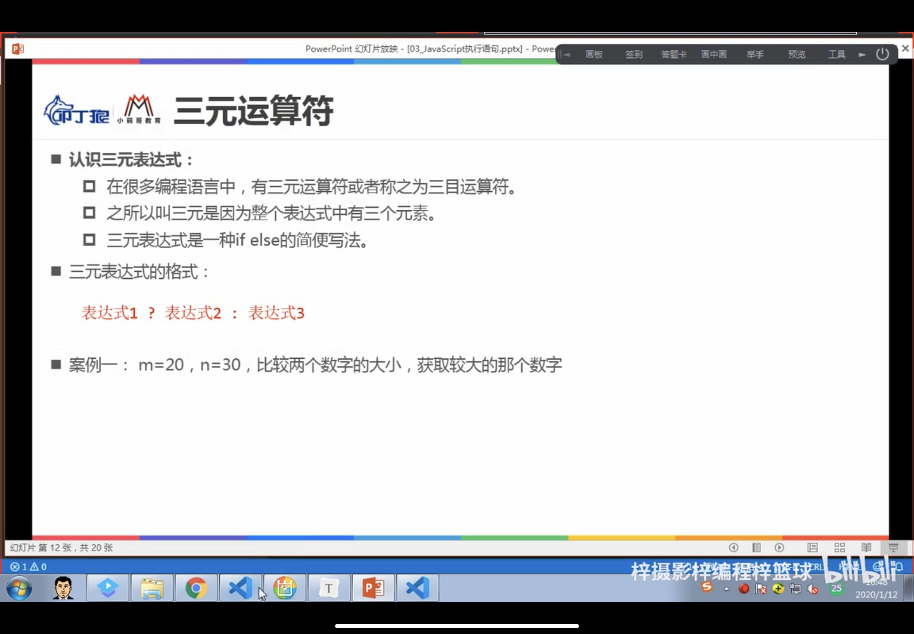

#### 2.4、Switch语句

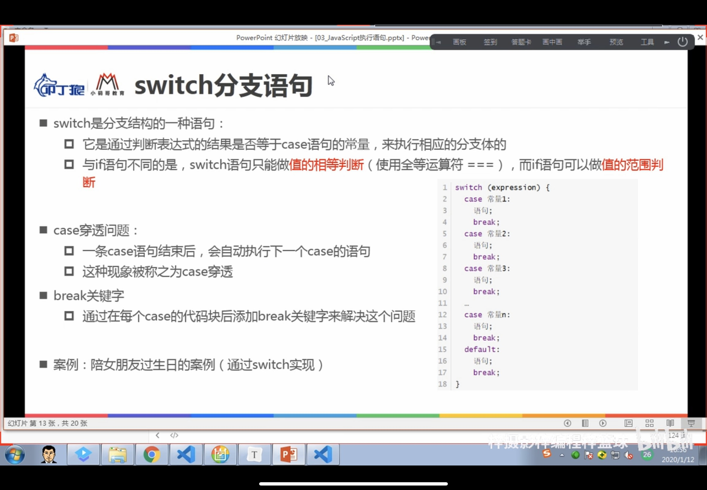

```js
        var holiday_name = prompt("请输入今天的节日");

        switch (holiday_name) {
            case "情人节":
                console.log("买玫瑰、看电影");
                break;
            case "平安夜":
                console.log("买苹果、吃大餐");
                break;
            case "生日会":
                console.log("买蛋糕、开party");
                break;
            default:
                console.log("上班工作");
                break;
        }
```

每个case之后都必须要加上break，否则会发生**case穿透**，也就是如果输入“情人节”，那么结果是情人节后面的情况都会显示出来

### 3、循环 

#### 3.1例子：计算1-99的和（while循环，for循环）

```js
var i = 0;
var sum = 0;

while (i <= 99) {

    sum = i + sum;
    ++i;
}
console.log(sum, i);//4950 100
```


```js
var sum = 0;

for (var i = 1; i < 100; i++) {
    sum = sum + i;
}

console.log(sum);
```

#### 3.2案例：99乘法口诀表

```js
// 乘法口诀表
document.write("<div>");
for (var i = 1; i < 10; i++) {
    for (var j = 1; j <= i; j++) {
        var mult = i * j;
        document.write("<span>"+j + "×" + i + "=" + mult+"</span>");
    }
    document.write("<br>");
}
document.write("</div>");
```

```css
span{
    display: inline-block;
    width: 80px;
    height: 30px;
    line-height: 30px;
    border-top: 1px solid #00f;
    border-right: 1px solid #00f;
    text-align: center;
}
div{
    display: inline-block;
    border-left: 1px solid #00f;
    border-bottom: 1px solid #00f;
}
```

#### 3.3、循环跳转

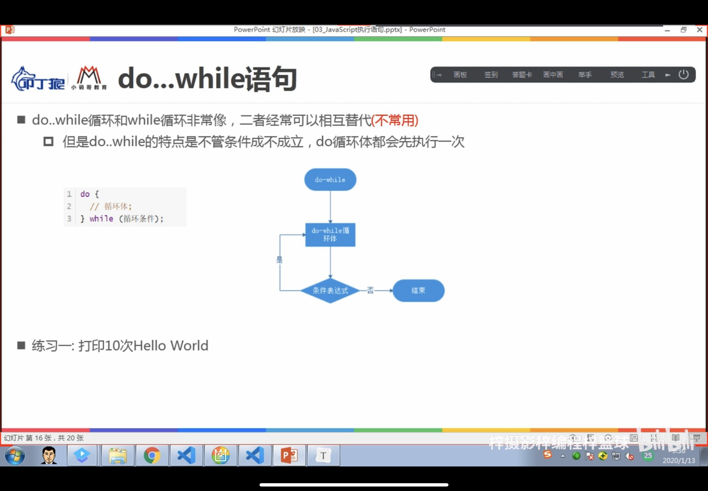

 

#### 3.4、断点调试（debugger）

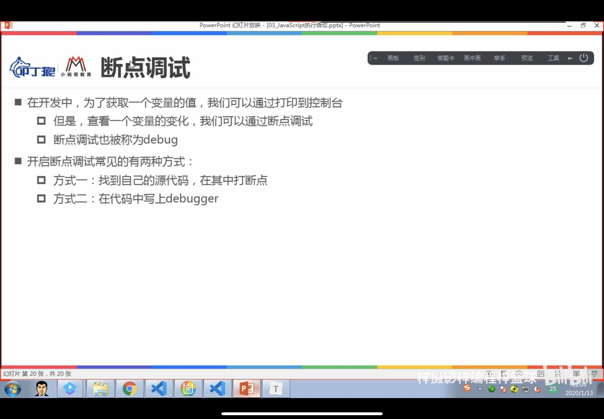

