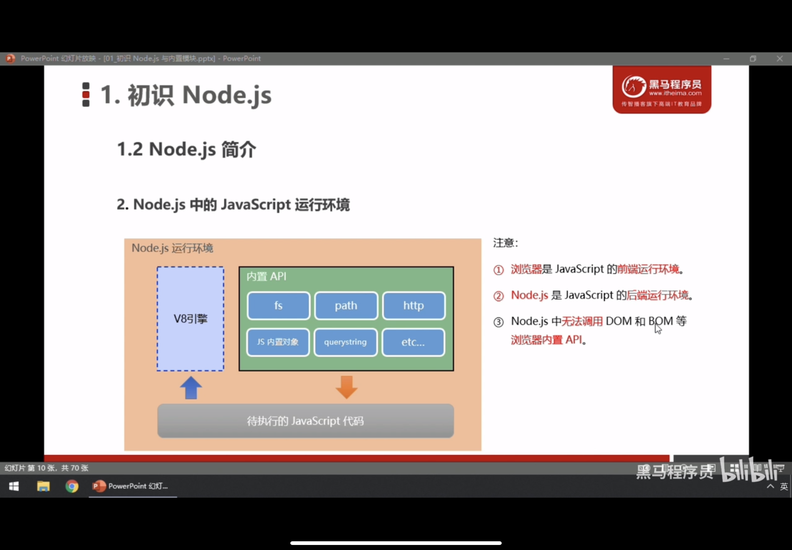
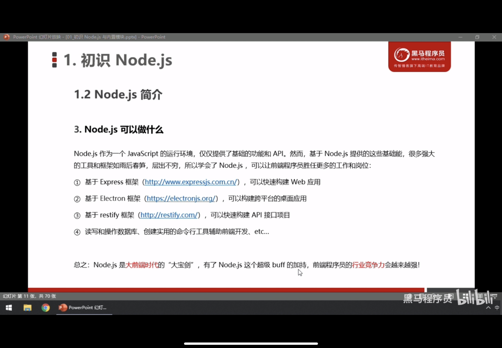
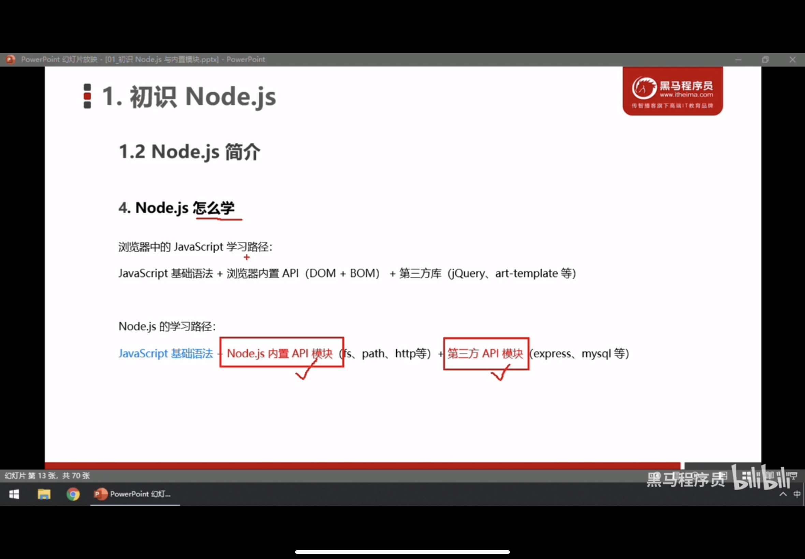
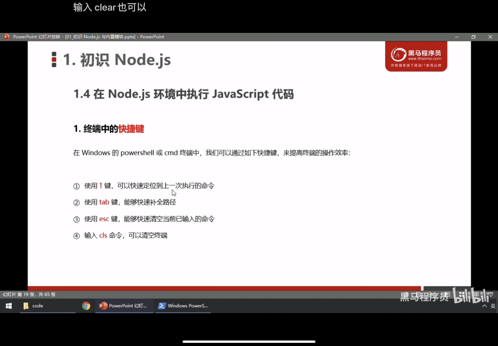
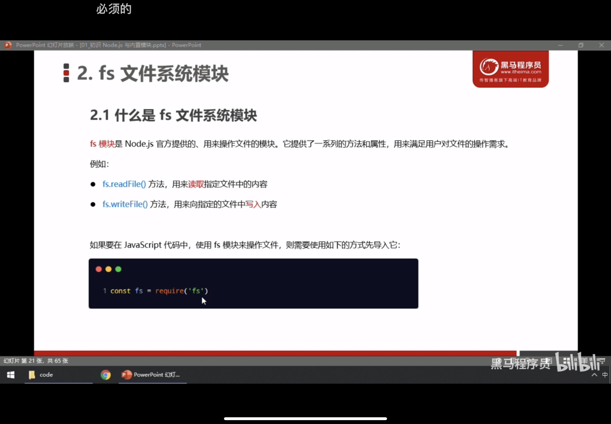
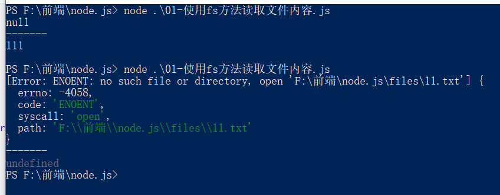
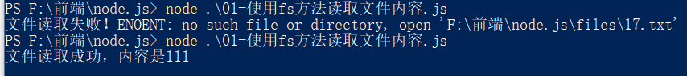

# 一、初识 node.js

## 1.为什么JavaScript 可以在浏览器中被执行？

待执行的js文件被浏览器所带的JavaScript解析引擎所解析，不同浏览器所带引擎不一样

* Chrome浏览器  =>  V8
* firefox浏览器  =>  odinMonkey(奥丁猴)
* safri浏览器  =>  JScore
* IE浏览器  =>  Chakra (查克拉)
* 其中Chrome浏览器的解析引擎最好用

## 2.为什么JavaScript可以操作BOM和DOM？

每个浏览器都内置了BOM和DOM这样的内置API函数，所以才可以操作他们

## 3.浏览器中JavaScript的运行环境

* V8引擎负责解析和执行JavaScript代码
* 内置API是由运行环境提供的特殊接口，只能在所属的运行环境中被调用

## 4.JavaScript能否做后端开发

后端：Java  Python  PHP

前端：可以借助node.js来做后端

## 5.什么是node.js

### 5.1 node.js是基于Chrome V8 引擎的JavaScript 运行环境（runtime）

分为LTS版本和Current版本

LTS版本 为长期稳定版 对于最求稳定的企业及项目来说，推荐安装LTS版本的 node.js

Current版本为新特性尝鲜版，对于热衷尝试新特性的用户来说，可以尝试，但是会存在隐藏的bug或者安全性漏洞

### 5.2 node.js中的JavaScript运行环境



### 5.3 node.js 可以干什么？



### 5.4 如何学？



### 5.5查看安装的版本号

打开终端： win+R -> 输入cmd

然后输入：node -v    即可查看版本号

## 6.什么是终端？

终端（terminal）是专门为开发人员设计的，用于人机交互

**新版终端：**在要打开的文件目录下   shift+右键  打开powershell 即可使用新版终短

**旧版终端：** win+R -> 输入cmd  如果要更改根目录，则先更改根目录，后用 cd 更改文件目录

### 6.1终端常用快捷键

## 7.fs文件系统模块

### 7.1 定义



### 7.2 读取指定文件内容

.png)

```js
// 1.导入fs模块 操作文件
const fs = require("fs");

// 2.调用fs.readFile()方法读取文件
// 参数1：读取文件的存放路径
// 参数2：读取文件的编码格式，一般为utf-8
// 参数3：回调函数，拿到读取失败和成功的结果

fs.readFile('./files/11.txt', 'utf-8', function(err, dataStr) {
  // 2.1打印失败的结果
  // 如果读取成功，则err的值为null
  // 如果读取失败，则err的值为错误对象，dataStr的值为 undefined
  console.log(err);
  console.log("-------");
  // 2.2打印成功的结果
  console.log(dataStr);
})
```



#### 7.2.1根据err的值是否为null，判断文件是否读取成功

```js
// 判断内容是否读取成功
fs.readFile('./files/1.txt', 'utf-8', function(err, result) {
  if(err){
    console.log("文件读取失败！"+ err.message);
  }
  else{
    console.log("文件读取成功，内容是"+result);
  }
})
```



### 7.3 向指定文件写入内容

```js
const fs = require('fs');

// 参数1：写入文件的存放路径
// 参数2：写入文件的编码格式，一般为utf-8
// 参数3：回调函数，拿到写入成功或者失败的结果

// 如果文件写入成功 err = null
// 如果文件写入失败 则err的值为错误对象
fs.writeFile('./files/2.txt', 'hello nodejs','utf-8', function(err){
  if(err === null){
    return console.log("写入成功");
  }
  console.log("写入失败"+err.message);
})

fs.writeFile('F:/files/22.txt', 'hello nodejs','utf-8', function(err){
  if(err === null){
    console.log("写入成功");
  }
  else{
    console.log("写入失败,错误原因如下:"+err.message);
  }
})
```

.PNG)

### 7.4 案例 修改成绩单排版

```js
const fs = require('fs');
fs.readFile('./files/成绩单横排.txt', 'utf-8', function(err,dataStr){
  if(err){
    return console.log('读取失败'+err.massage);
  }
  // console.log('读取成功'+dataStr);

  // 把成绩分割
  let arr = dataStr.split('  ');
  const arrNow = [];
  arr.forEach(item => {
    arrNow.push(item.replace(' ', ': '));
  })
  // console.log(arrNow);
  // console.log(newStr);
  const newStr = arrNow.join('\r\n');
  // 写入成绩单
  fs.writeFile('./files/成绩单竖排.TXT', newStr, function(err){
    if(err){
      return console.log('写入失败, 失败原因如下:' + err.massage);
    }
    console.log('写入成功，你真棒!');
  })
})
```

### 7.5 路径动态拼接问题

可以用 __dirname 来解决相对路径拼接问题

## 8.path路径模块

* path.join()  合并路径

```js
const path = require('path');

// const pathStr = path.join('/a','/b/c','/d', '/e');
// console.log(pathStr); //  \a\b\c\d\e

// ../ 会抵消前面的路径
const pathStr = path.join('/a','/b/c','../','/d', '/e');
console.log(pathStr); //  \a\b\d\e
```

* path.basename( ‘ 文件路径 ’ ，[ ‘ 文件拓展名 ’ ])  通过路径，获得文件名称

```js
const path = require('path');

// 可以获得文件名
const fpath = path.basename('/b/c/a/index.html');
console.log(fpath); // index.html

// 输入第二个参数，可以获得文件名部分
const fpathWithoutExt = path.basename('/b/c/a/index.html','.html');
console.log(fpathWithoutExt);
```

* path.extname('文件路径') 获取文件中的扩展名

```js
console.log(path.extname('/a/s/df/f/index.html')); // .html
```

