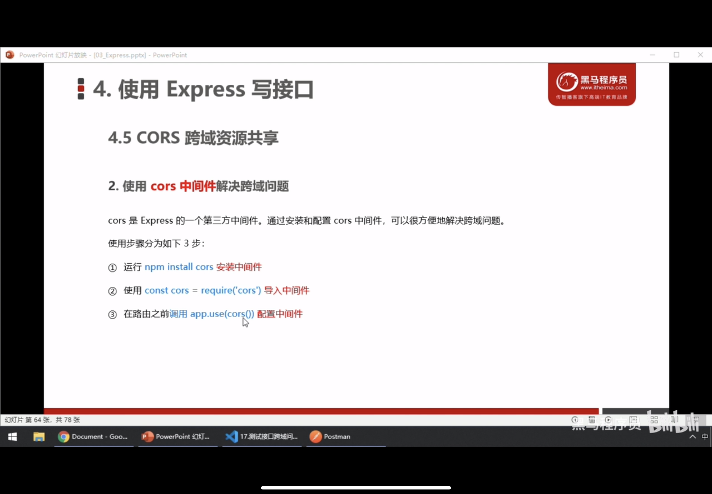
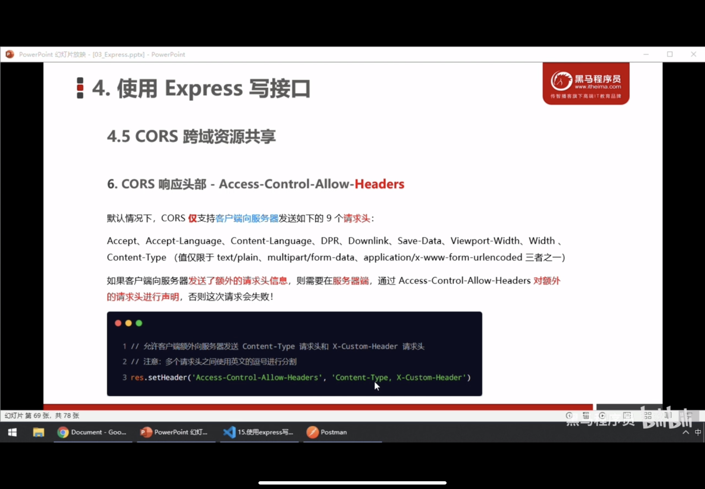

# 一、Express初认识

## 1.定义

Express是基于Node.js平台，快速，开放，极简的web开发框架

## 2.进一步理解express


## 3.express可以做什么？


## 4.基本使用

### 4.1 初步安装

表示安装4.17.1版本的express

```powershell
npm i express@4.17.1
```

### 4.2 创建基本的web服务器

```js
// 1.导入express

const express = require('express');
// 2.创建 web 服务器
const app = express();

// 4.监听客户端的get和post请求
 app.get('/',(req,res) => {
  //  向客户端响应一个json对象
  //  res.send({"name": "66y",});
  //  通过 req.query 可以获取到客户端发送过来的 查询参数
  // 注意：默认情况下，req.query是一个空对象
  //  console.log(req.url);
  //  console.log(req.query);
   res.send(req.query);
 })
 app.post('/',(req,res) => {
  //  向客户端响应一串文本字符串
   res.send('请求成功', req.query);
 })
// 3. 启动 web 服务器
app.listen(80, () => {
  console.log('express server is running at http://127.0.0.1:80');
})
```

### 4.3 获取url中的动态参数


```js
// 1.导入express

const express = require('express');
// 2.创建 web 服务器
const app = express();

// 4.监听客户端的get和post请求
 app.get('/', (req, res) => {
  //  向客户端响应一个json对象
  //  res.send({"name": "66y",});
  //  通过 req.query 可以获取到客户端发送过来的 查询参数
  // 注意：默认情况下，req.query是一个空对象
   res.send(req.query);
 })
//获取动态参数
 app.get('/user/:id', (req, res) => {
  res.send(req.params);
 })

 app.post('/', (req, res) => {
  //  向客户端响应一串文本字符串
   res.send('请求成功', req.query);
 })
// 3. 启动 web 服务器
app.listen(80, () => {
  console.log('express server is running at http://127.0.0.1:80');
})
```

### 4.4 托管静态资源


### 4.5 nodemon 的使用


## 5.认识路由

Express中的路由是客户端请求与服务器处理函数之间的映射关系，由三部分组成，请求的类型，请求的URL地址，处理函数，格式如下：

```js
app.METHOD(PATH, HEADLE)
```

### 5.1 路由的匹配过程


### 5.2 路由模块化

#### 5.2.1 创建路由模块

```js
// 1.导入express
const express = require('express');
// 2.创建路由对象
const router = express.	Router();


// 3.挂载具体的路由
router.get('/', (req, res) => {
  res.send('这是get请求')
})
router.post('/', (req, res) => {
  res.send('这是post请求')
})

// 4.暴露路由对象
exports = router;
```

#### 5.2.2 注册路由模块

```js
// 1.导入express
const express = require('express');

const app = express();

// 2.导入路由模块
const router = require('./router');
// 3.注册路由模块
// app.use()注册全局中间件
// 以下语法添加了前缀
app.use('/router', router);

app.listen(80, () => {
  console.log('http://127.0.0.1:80');
})
```

## 6.Express 中间件

### 6.1 中间件的调用流程


### 6.2 中间件的格式

中间件本质是一个函数

```js
const express = require('express');
const app = express();

// 定义一个最简单的中间件
const wm = function(req, res, next) {
  console.log('这是一个最简单的中间件');
  // 把流转关系，转交给下一个中间件或者路由
  next();
}

// 注册全局中间件
app.use(wm);

app.get('/', (req, res) => {
  res.send('home page');
})
app.get('/user', (req, res) => {
  res.send('user page');
})

app.listen(80, () => {
  console.log('http://127.0.0.1');
})
```


### 6.3 next函数的作用


### 6.4 全局生效的中间件


### 6.5 中间件的作用


```js
const express = require('express');
const app = express();
const  time = require('./14_dateFormat');

// 定义一个最简单的中间件
const reqT = function(req, res, next) {
  // 为req对象挂载自定义属性
  req.requestTime = time.dateFormat(new Date());
  dt = time.dateFormat(new Date());
  // 把流转关系，转交给下一个中间件或者路由
  next();
}
// 注册全局中间件
app.use(reqT);

app.get('/', (req, res) => {
  res.send('主页请求于 ' + req.requestTime);
})
app.get('/user', (req, res) => {
  res.send('用户页请求于 ' + dt);
})

app.listen(80, () => {
  console.log('http://127.0.0.1');
})
```

### 6.6 局部生效的中间件

```js
const express = require('express');
const app = express();
const  time = require('./14_dateFormat');

// 定义一个最简单的中间件
const reqT = function(req, res, next) {
  // 为req对象挂载自定义属性
  req.requestTime = time.dateFormat(new Date());
  dt = time.dateFormat(new Date());
  // 把流转关系，转交给下一个中间件或者路由
  next();
}

// 定义局部中间件
const mw1 = (req, res, next) => {
  console.log('局部生效的中间件函数');
  next();
}
// 注册全局中间件
app.use(reqT);

app.get('/', mw1, (req, res) => {
  res.send('主页请求于 ' + req.requestTime);
})

app.get('/user', (req, res) => {
  res.send('用户页请求于 ' + dt);
})

app.listen(80, () => {
  console.log('http://127.0.0.1');
})
```

#### 6.6.2 定义多个局部中间件

```js
app.get('/', mw1, mw2, (req, res) => {
  res.send('主页请求于 ' + req.requestTime);
})

// 两种方法
app.get('/', [mw1, mw2], (req, res) => {
  res.send('主页请求于 ' + req.requestTime);
})
```

### 6.7 中间件使用注意事项


### 6.8 中间件的分类

#### 6.8.1 应用级别的中间件


#### 6.8.2 路由级别的中间件


#### 6.8.3 错误处理的中间件


**注意**：错误处理中间件必须注册在所有路由之后

```js
const express = require('express');
const app = express();

// 定义错误级别的中间件，捕获整个项目的错误情况，从而防止整个项目的奔溃


app.get('/', (req, res) => {
  // 人为制造错误
  throw new Error('服务器内部发生错误');
  res.send('Home page');
})

// 错误处理中间件必须注册在所有路由之后
// 四个参数：err,req, res, next
app.use((err,req, res, next) => {
  console.log('error exist '+err.message);
  res.send('error ' + err.message);
  })

app.listen(80, () => {
  console.log('http://127.0.0.1:80');
})
```

#### 6.8.4 内置中间件

- [express.static](https://www.expressjs.com.cn/en/4x/api.html#express.static) serves static assets such as HTML files, images, and so on.
- [express.json](https://www.expressjs.com.cn/en/4x/api.html#express.json) parses incoming requests with JSON payloads. **NOTE: Available with Express 4.16.0+**
- [express.urlencoded](https://www.expressjs.com.cn/en/4x/api.html#express.urlencoded) parses incoming requests with URL-encoded payloads. **NOTE: Available with Express 4.16.0+**
- 

```js
const express = require('express');
const app = express();

// 可以解析以json格式传上来的请求体
app.use(express.json());
// 可以解析以urlencoded格式传上来的请求体
app.use(express.urlencoded({extended: false}));

app.post('/', (req, res) => {
  console.log(req.body);
  res.send('post ok');
})
app.post('/books', (req, res) => {
  console.log(req.body);
  res.send('post ok');
})

app.get('/', (req, res) => {
res.send('get ok');
})

app.listen(80, () => {
  console.log('http://127.0.0.1');
})
```

**结果**

```powershell
PS F:\前端\node.js> node .\24_内置中间件的使用.js
body-parser deprecated undefined extended: provide extended option 24_内置中间件的使用.js:5:17
http://127.0.0.1
{ bookname: '水浒传', author: '施耐庵' }
PS F:\前端\node.js> node .\24_内置中间件的使用.js
http://127.0.0.1
[Object: null prototype] { bookname: '水浒传', author: '施耐庵' }
```

#### 6.8.5 第三方中间件


### 6.9 自定义中间件


#### 6.9.1 监听req的data事件

**qs被弃用了？？？**

```js
const express = require('express');
const app = express();

// 导入内置的querystring模块
const querystring = require('querystring');

// 1.自定义中间件
app.use((req, res, next) => {
  // 监听req的data事件
  let str = '';
  req.on('data', (chunk) => {
    str += chunk;
  })
  // 监听req的end事件
  req.on('end', () => {
    // str 中存放的是完整的请求体数据
    const body = querystring.parse(str)
    console.log(str);
    console.log(body);
    req.body = body;
  })
  next();
})

app.post('/', (req, res) => {
  console.log(req.body);
  res.send(req.body);
})

app.listen(80, () => {
  console.log('http://127.0.0.1');
})
```

## 7.编写接口


## 8.基于cors 解决接口跨域问题








### 8.1 简单请求


### 8.2 预检请求


### 8.3 两者之间的区别


## 9.JSONP接口

### 9.1 定义


### 9.2 创建此接口的注意事项


### 9.3 jsonp接口调用函数


### 9.4 在网页中使用jQuery发起jsonp请求


