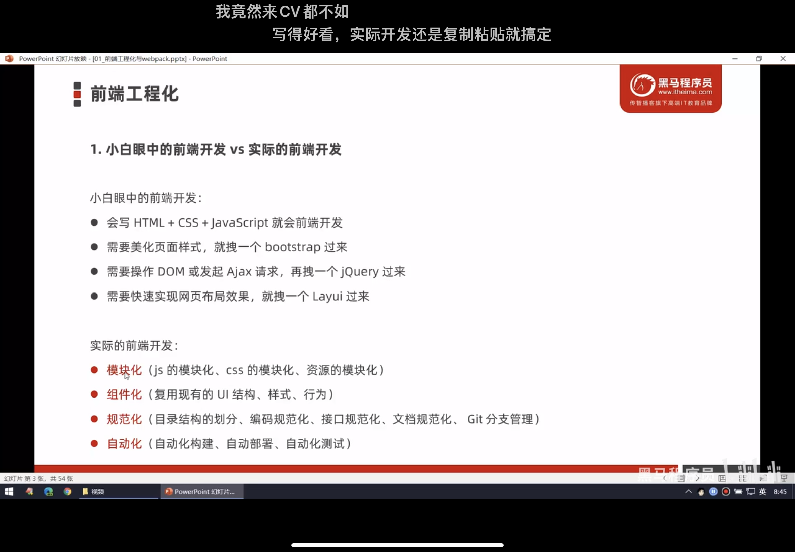

# 一·、前端工程化and webpack

## 1.前端工程化

在企业级的前端项目开发中，把前端所需的工具，技术，流程，经验等进行规范化，标准化。

企业中的Vue和react都是基于工程化的方式进行开发的。

好处：前端开发自成体系，有一套标准的开发方案和流程

## 2.前端工程化解决方案

早期的前端工程化解决方案，已经被边缘化

grunt  gulp

目前主流的前端工程化解决方案

webpack

parcel

### 3.什么是webpack

**概念**：前端工程化的一个解决方案

**主要功能**：提供有好的前端模块化开发支持，以及代码压缩混淆，处理浏览器端 javascript 的兼容性，性能优化等强大的功能

**好处**：让程序员把工作重心放到具体功能的实现，提高前端开发的效率及项目的可维护性。

目前Vue react 等前端项目都是基于webpack进行的工程化开发

