# 学习目标

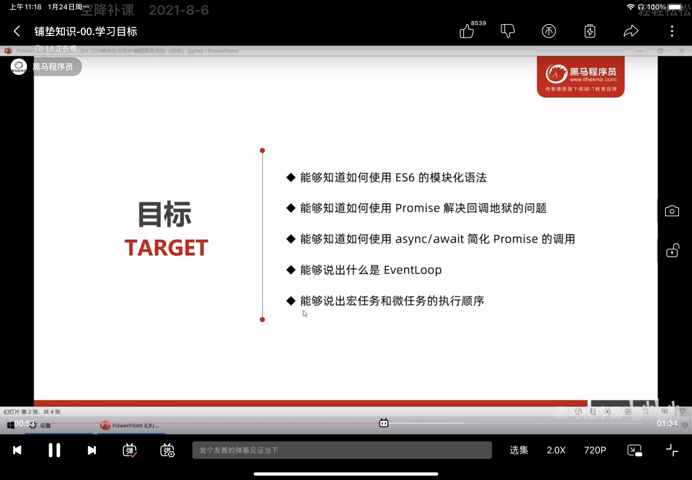

# 一、es6模块化

## 1.node.js如何实现模块化？

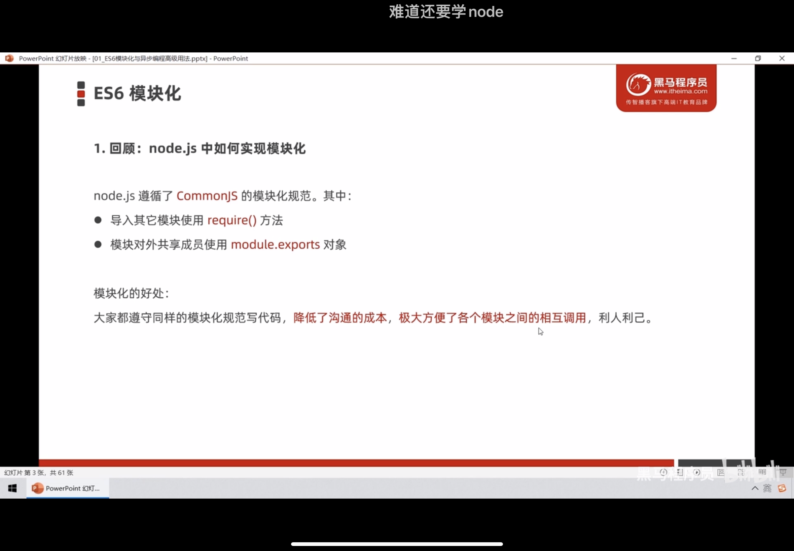

## 2.前端模块化的规范分类

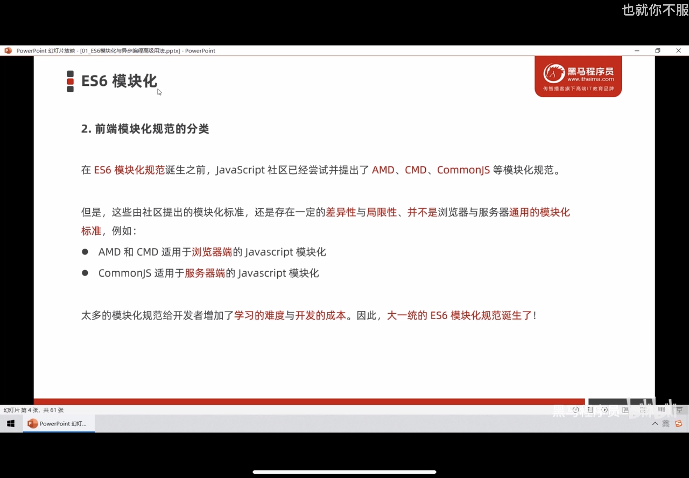

## 3.es6模块化规范

ES6模块化规范是**浏览器端**和**服务器端**通用的模块化开发规范，他的出现极大地降低了前端开发者的模块化学习成本，开发者不需要额外学习AMD，CMD，或Common JS等模块化规范。

es6模块化规范定义：

每个js文件都是一个独立的模块

导入其他模块成员使用import关键字

向外共享模块成员使用export关键字

## 4.在node.js中体验ES6模块化

## 5.ES6模块化的基本语法

### 5.1 默认导出和默认导入

```js
// 默认导出
let n1 = 10; // 定义模块私有成员 n1
let n2 = 20; // 定义模块私有成员，n2（外界访问不到n2,因为它没有被贡献出去）

function show() {} // 定义模块私有方法 show
export default { // 使用export default 默认导出语法，向外导出n1, 和show两个成员
    n1,
    show,   
} 

// 默认导入 import 接收名称 from '模块标识符'
```

### 5.2 按需导出和按需导入

```js
// 按需导出
export let s1 = 'aaa';
export let s2 = 'ccc';
export function say() {};

// 按需导入
import {s1, s2,} from './03.按需导出.js';
console.log(s1);
```

注意事项：

* 每个模块可以按需多次导出

* 按需导入的成员名称必须和按需导出的名称保持一致

* 按需导入的时候，可以使用as关键字进行重命名

* 按需导入可以和默认导入一起使用

* ```js
  // 花括号外面的成员为默认导出的成员，花括号里面的是按需导出的成员
  import m1, {s1 as m2, s2,} from './03.按需导出.js';
  
  console.log(m2);
  console.log(m1);
  ```

### 5.3 直接导入并执行模块中的代码

```js
// 05.直接运行模块化中的代码.js
for (let i = 0; i <= 10; i++) {
  console.log(i);
}
// --------- 另一个文件-------
import './05.直接运行模块化中的代码.js';

//终端运行结果
0
1
2
3
4
5
6
7
8
9
10
```

# 二.promise

### 6.1 回调地狱

多层回调函数得相互嵌套，就形成了回调地狱

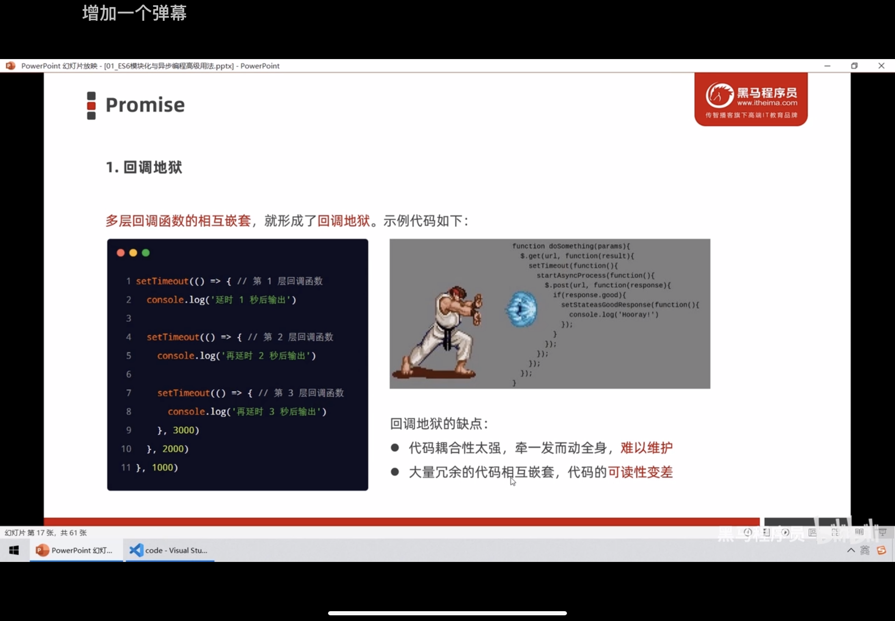

### 6.2 promise 的基本概念

* promise 是一个构造函数
  * 我们可以创建一个promise的实例， const p = new Promise()
  * new 出来的promise实例对象，代表一个异步操作

* Promise.prototype 上包含一个 .then() 方法
  * 每一次new Promise() 构造函数得到的实例对象
  * 都可以通过原型链的方式访问到  .then()  方法，例如 p.then()

* .then()方法用来预先指定成功的和失败的回调函数
  * p.then(成功的回调函数，失败的回调函数)；
  * p.then(result => {}, error => {})
  * 成功的回调函数必选，失败的回调函数可选

### 6.3 基于回调函数按顺序读取文件

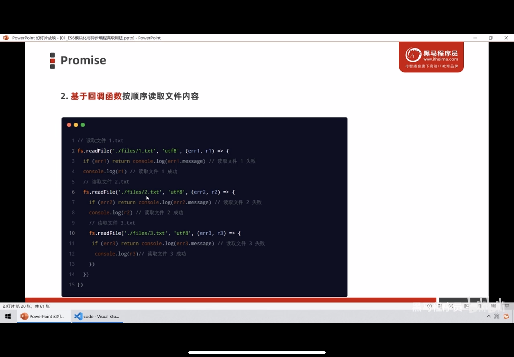

### 6.4 基于then-fs 读取文件内容

#### 6.4.1 安装then-fs第三方包

```powershell
npm i then-fs
```

#### 6.4.2 then-fs的基本使用

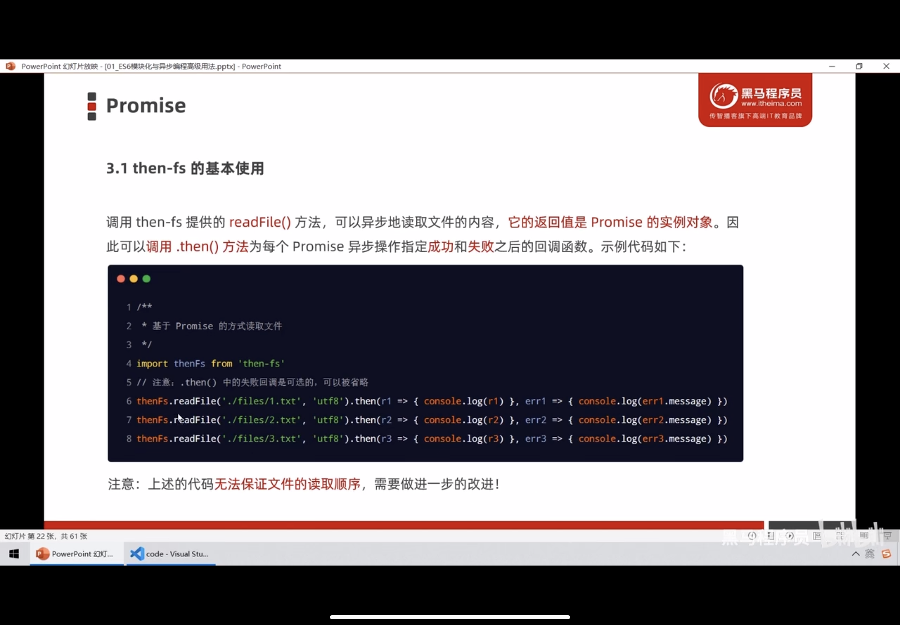

他们是异步操作，不可以保证文件读取顺序

#### 6.4.3 基于 promise 按顺序读取文件内容

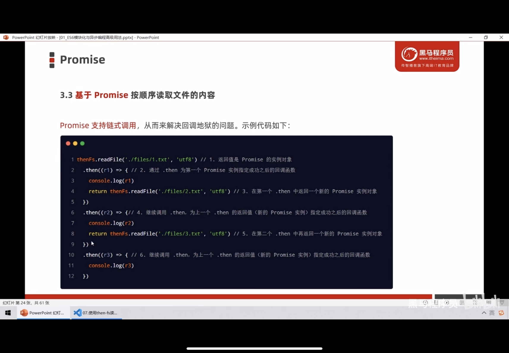

### 6.5 通过 .catch 捕获错误

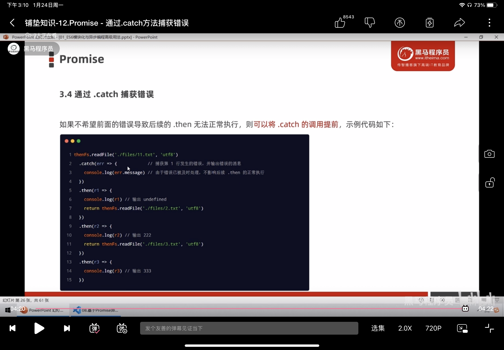

### 6.6 Promise.all() 方法

promise.all() 方法会发起并行的Promise异步操作，等所有的异步操作全部结束之后才会执行下一步的.then操作（等待机制）。 实例代码如下：

```js
import thenFs from 'then-fs';
 
const promiseArr = [
  thenFs.readFile('./files/1.txt', 'utf-8'),
  thenFs.readFile('./files/2.txt', 'utf-8'),
  thenFs.readFile('./files/3.txt', 'utf-8'),
]
  Promise.all(promiseArr).then(result => {
  console.log(result);
})
```

### 6.7 Promise.race() 方法

promise.race() 方法会发起并行的Promise异步操作，只要其中一个异步操作完成，就会立即执行下一步的.then操作（赛跑机制）。 实例代码如下：

```js
import thenFs from 'then-fs';
 
const promiseArr = [
  thenFs.readFile('./files/1.txt', 'utf-8'),
  thenFs.readFile('./files/2.txt', 'utf-8'),
  thenFs.readFile('./files/3.txt', 'utf-8'),
]
  Promise.race(promiseArr).then(result => {
  console.log(result);
})
```

### 6.8 基于Promise封装读文件的方法

#### 6.8.1 封装方法要求

* 方法的名称要定义为getFile
* 方法接受一个形参fpath，表示要读取的文件的路径
* 方法的返回值为promise实例对象

#### 6.8.2 getFile 方法的基本定义

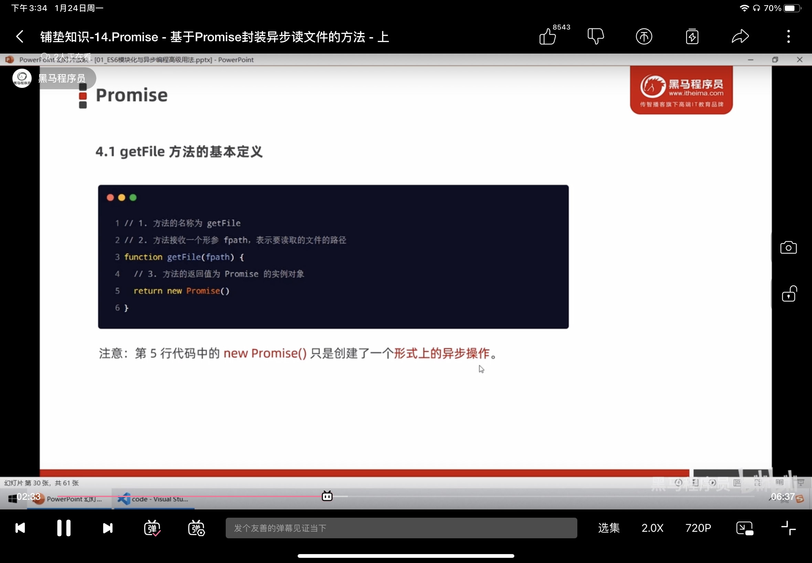

#### 6.8.3 创建具体的异步操作

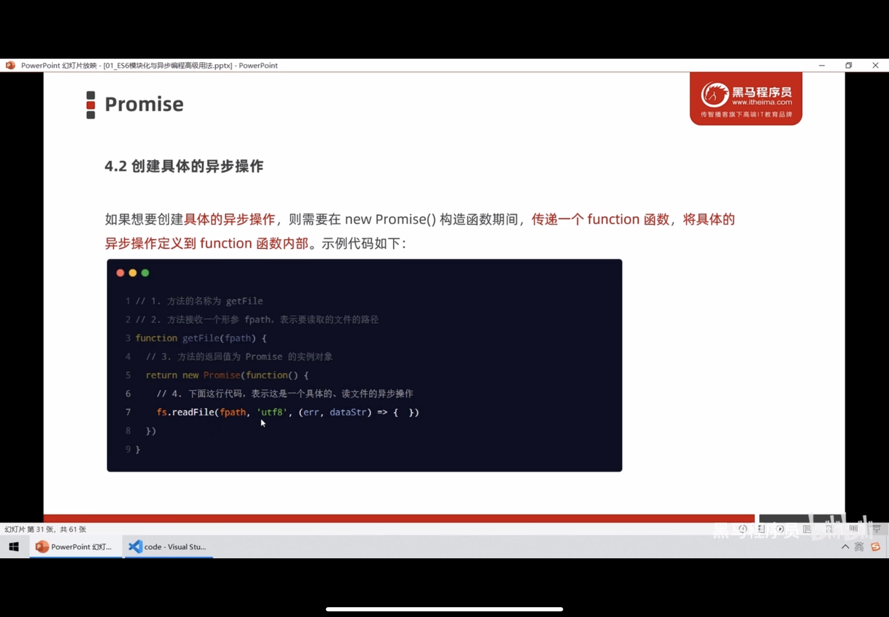

#### 6.8.4 获取.then() 的两个实参

的两个实参.png)

```js
import fs from 'fs';
function getFile (fpath) {
  return new Promise(function (resolve, reject) {
    fs.readFile(fpath, 'utf-8', (err, dataStr) => {
      if(err) return reject(err); // 读取失败，调用“失败的回调函数”
      resolve(dataStr); // 读取成功，调用成功的回调函数
    })
  })
}

getFile('./files/1.txt').then((r1) => {console.log(r1)}, (err1) => {console.log(err1.message)})
```

# 三.async/ await

## 1.定义

## 2.基本使用

await用于返回值为对象实例的方法前，放在前面之后，返回的就不再是对象实例，而是一个值，只要使用await 那么就需要使用async放在函数前面修饰

```js
import thenfs from 'then-fs';
async function getAllFiles() {
  const r1 = await thenfs.readFile('./files/1.txt', 'utf-8');
  console.log(r1);
  const r2 = thenfs.readFile('./files/2.txt', 'utf-8');
  console.log(r2);

  //这两个输出是一样的，都是3.txt里面的内容,上一种方法用于改进下一种方法
  const r3 = await thenfs.readFile('./files/3.txt', 'utf-8');
  console.log(r3);
  thenfs.readFile('./files/3.txt', 'utf-8').then((r3)=> {
    console.log(r3);
  });
}
getAllFiles();
```

## 3.使用注意事项

* 如果function中使用了await，则function必须被async修饰

* 在async方法中，第一个await之前的代码会被同步执行，await之后的代码会被异步执行

  ```js
  import thenfs from 'then-fs';
  console.log('A');
  async function getAllFiles() {
    console.log('D');
  
    const r1 = await thenfs.readFile('./files/1.txt', 'utf-8');
    console.log(r1);
    const r2 = thenfs.readFile('./files/2.txt', 'utf-8');
    console.log(r2);
  
    const r3 = await thenfs.readFile('./files/3.txt', 'utf-8');
    console.log(r3);
    
    thenfs.readFile('./files/3.txt', 'utf-8').then((r3)=> {
      console.log(r3);
    });
    console.log('E');
  }
  console.log('B');
  
  getAllFiles();
  console.log('C');
  ```

  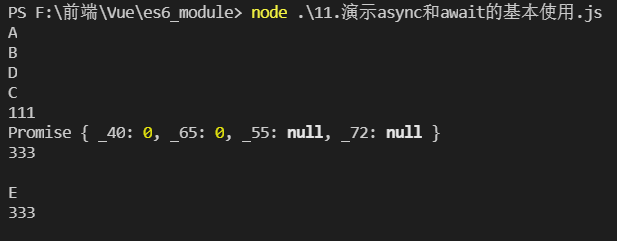

# 四.Eventloop

## 1.程序假死

javascript是单线程的语言，如果前一个任务没有执行完毕，后一个任务就会一直等待，从而出现程序假死的问题

## 2.同步任务和异步任务

为了防止某个耗时任务导致程序假死问题，js把待执行的任务分为两类：

### 2.1 同步任务（synchronous)

* 又叫做非耗时任务，指的是在主线程上排队执行的任务
* 只有前一个任务执行完毕，后面一个任务才可以被执行

### 2.2 异步任务(asynchronous)

* 又叫做耗时任务，异步任务由js委托给宿主环境进行执行
* 当异步任务执行完毕后，会通知javascript主线程执行异步任务的回调函数

### 2.3 同步任务和异步任务的执行过程

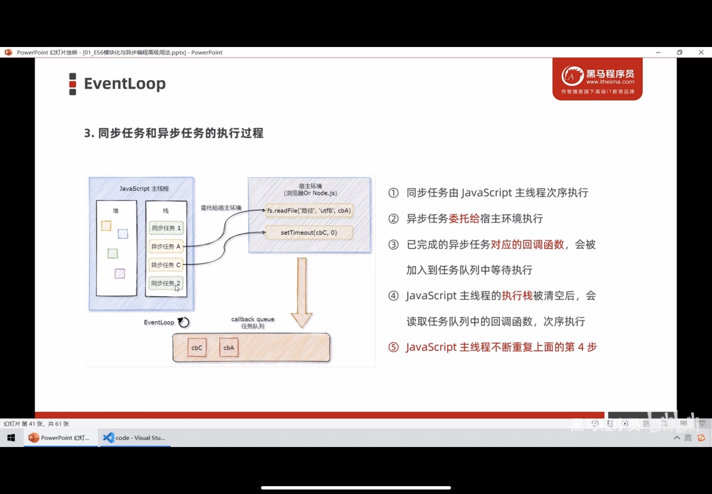

### 2.4 EventLoop的基本概念

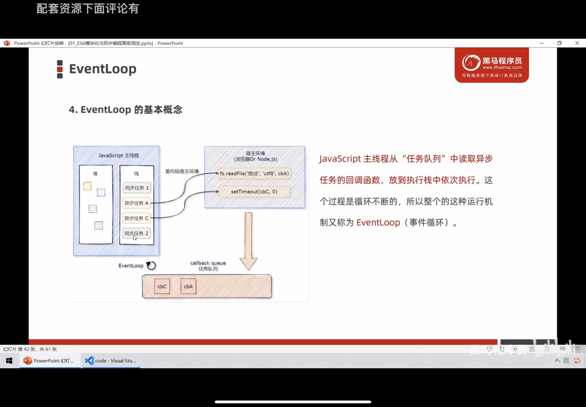

```js
// 例子一
import thenfs from 'then-fs';

console.log('A');
thenfs.readFile('./files/1.txt', 'utf-8').then((r1) => {
  console.log('B');
})

setTimeout(() => {
  console.log('C');
},0);
console.log('D');
```

结果如下：AD属于同步任务，bc会进入任务队列，谁先被宿主环境处理完毕，谁先进入任务队列，等待被执行

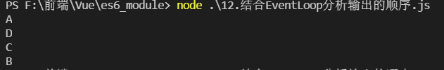

```js
// 例子二
import thenfs from 'then-fs';

console.log('A');
thenfs.readFile('./files/1.txt', 'utf-8').then((r1) => {
  console.log('B');
})

setTimeout(() => {
  console.log('C');
},1000);
console.log('D');
```

结果如下：

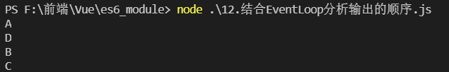

# 五.宏任务和微任务

## 1.概念

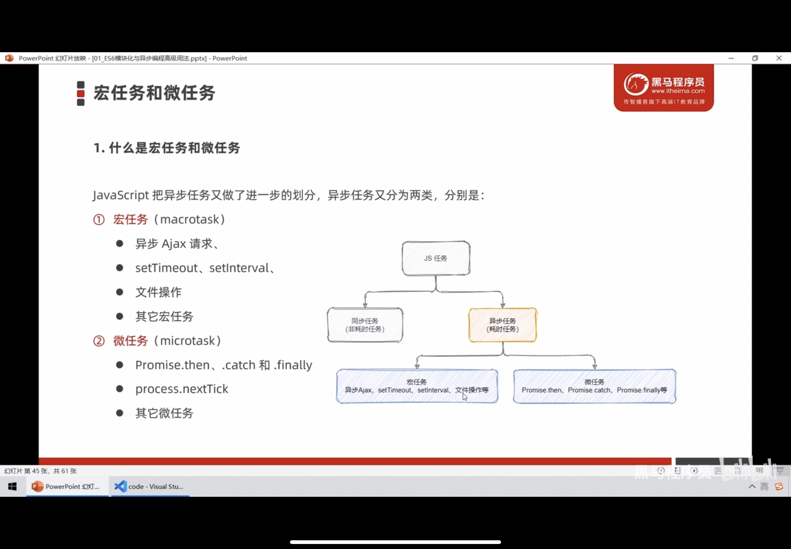

## 2.执行顺序

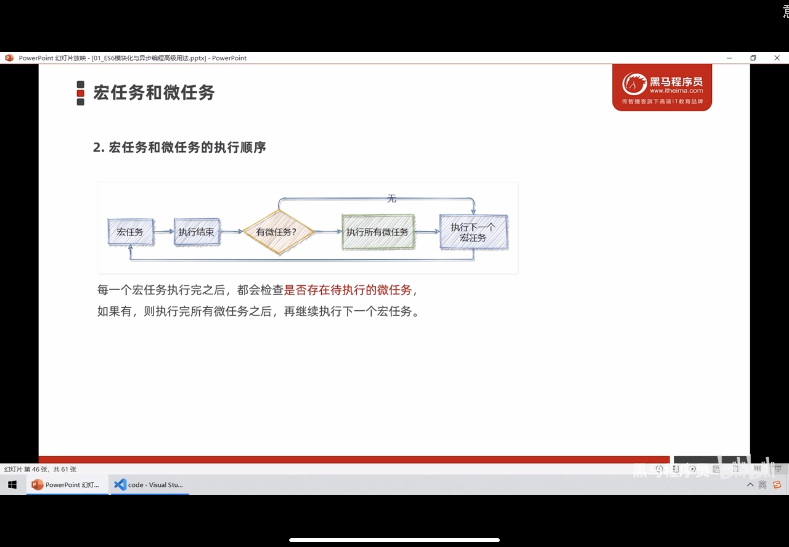

## 3.例子理解宏任务与微任务执行顺序

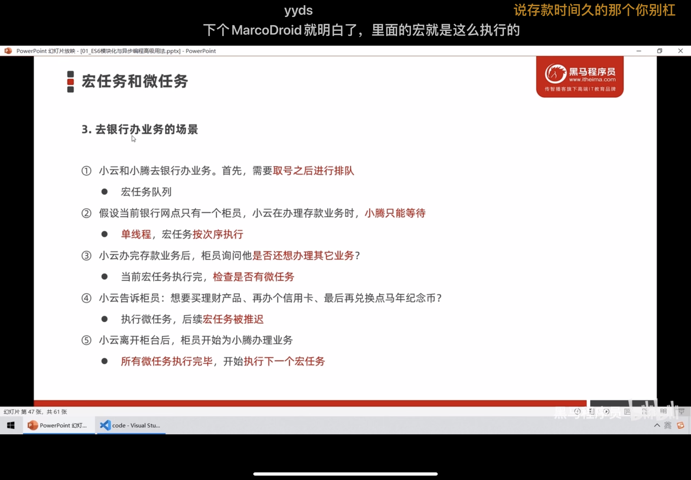

## 4.分析代码输出顺序

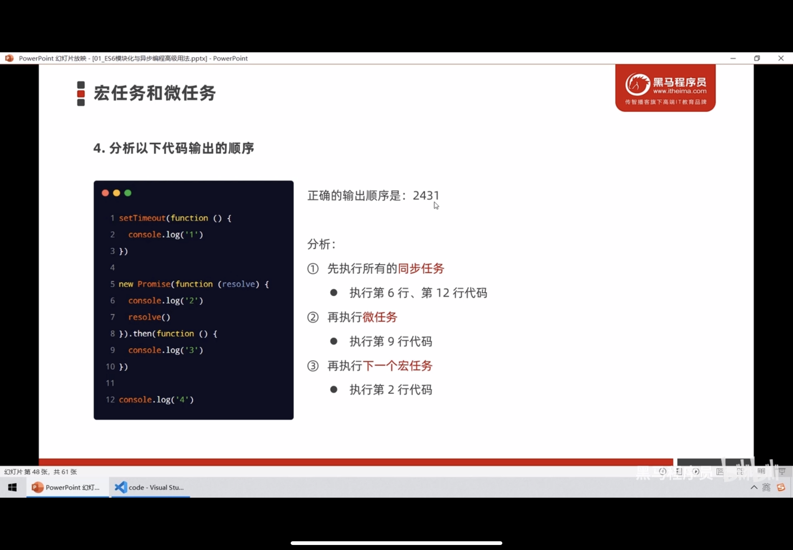

## 5.经典面试题

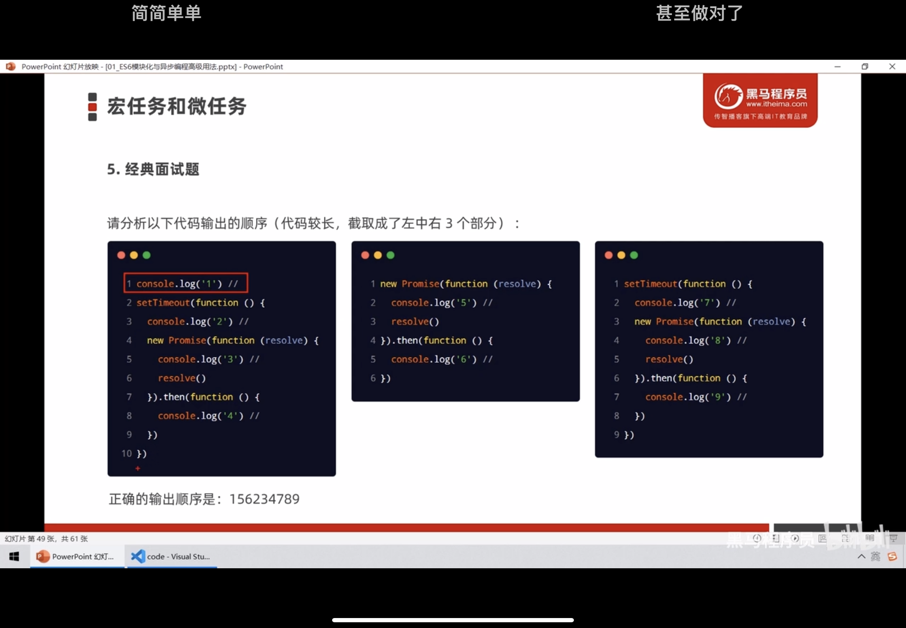

# 六.api接口案例

## 1.搭建项目的基本结构

* 在项目根目录中安装项目需要的express和mysql

* 导入es6模块

  在package.json中写入：“type”：“module”声明为es6模块

## 2.创建基本的服务器

```js
import express from 'express';
const app = express();
 // 导入路由并使用
import userRouter from './user_router/user_router.js';
app.use('/api', userRouter);

app.listen(80, () => {
  console.log('http:127.0.0.1:80');
})
```

## 3.创建db数据库操作模块

```js
import mysql from 'mysql2';

const db = mysql.createPool({
  host: '127.0.0.1',
  port: '3306',
  user: 'root',
  password: 'admin123',
  database: 'my_db_01',
})

// 必须加上 .promise(),否则不支持es6模块
export default db.promise();
```

## 4.创建user_ctrl业务模块

##### 使用try{……}catch{……}捕获错误

```js
import db from '../db/index.js';
export  async function getAllUsers(req, res) {
  try{
    const [rows] = await db.query('select * from ev_user ');
    res.send({
      status: 0,
      msg: '获取成功',
      data: rows,
    })
  }catch (err) {
    res.send({
      statu: 1,
      msg: '获取用户列表数据失败',
      desc: err.message,
    })
  }
}
```

## 5.创建user_router路由模块

```js
import express from 'express';
import {getAllUsers} from '../controller/user_ctrl.js';

const router = new express.Router();

router.get('/user', getAllUsers);

export default router;
```

